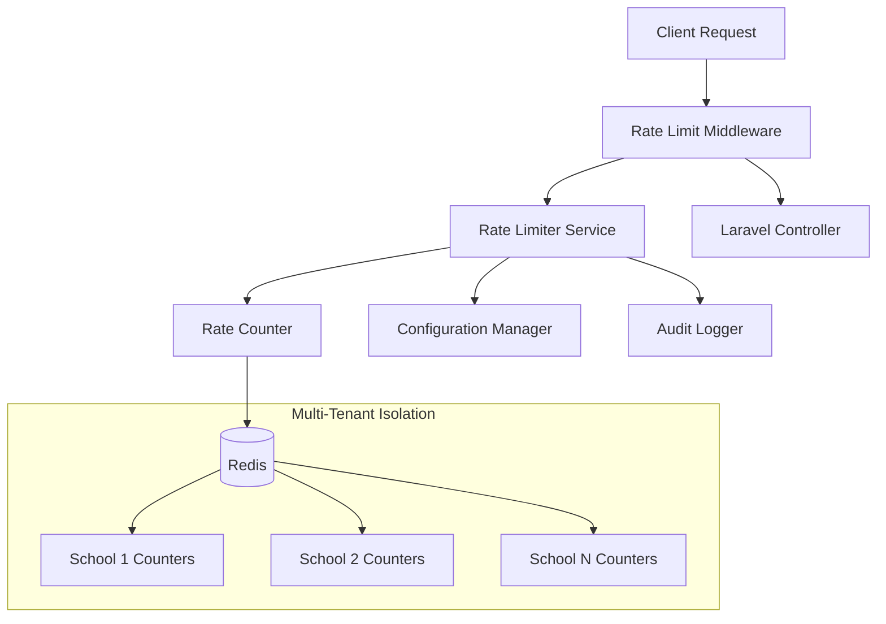

# Design Document: Critical Rate Limiting

## Overview

The Critical Rate Limiting system provides comprehensive protection for AbsensiQR Pro's critical endpoints through a multi-tenant, Redis-based rate limiting solution. The system implements a sliding window algorithm for accurate rate calculations, integrates seamlessly with Laravel's middleware pipeline, and provides configurable limits with graceful error handling.

The design prioritizes performance (<1ms overhead), accuracy (99.9% precision), and multi-tenant isolation while supporting admin bypass capabilities and comprehensive monitoring.

## Architecture

### High-Level Architecture



### Component Architecture

The system follows a layered architecture with clear separation of concerns:

1. **Middleware Layer**: Laravel middleware integration for request interception
2. **Service Layer**: Core rate limiting logic and business rules
3. **Storage Layer**: Redis-based counter management with atomic operations
4. **Configuration Layer**: Dynamic configuration management
5. **Monitoring Layer**: Logging, metrics, and alerting

### Multi-Tenant Design

Each school operates in complete isolation with separate Redis key namespaces:
- Key Pattern: `rate_limit:{school_id}:{endpoint}:{identifier}:{window}`
- Ensures one school's usage never affects another school's limits
- Supports different rate limits per school if needed

## Components and Interfaces

### Core Components

#### 1. RateLimitMiddleware
Laravel middleware that intercepts requests and applies rate limiting.

```php
interface RateLimitMiddleware
{
    public function handle(Request $request, Closure $next, string $limiter = null): Response;
    public function shouldBypass(Request $request): bool;
    public function buildRateLimitResponse(Request $request, int $retryAfter): Response;
}
```

#### 2. RateLimiterService
Core service managing rate limiting logic and Redis interactions.

```php
interface RateLimiterService
{
    public function attempt(string $key, int $maxAttempts, int $decaySeconds): RateLimitResult;
    public function remaining(string $key, int $maxAttempts, int $decaySeconds): int;
    public function reset(string $key): bool;
    public function clear(string $key): bool;
}
```

#### 3. SlidingWindowCounter
Implements sliding window algorithm using Redis sorted sets.

```php
interface SlidingWindowCounter
{
    public function increment(string $key, int $windowSeconds, int $maxCount): CounterResult;
    public function count(string $key, int $windowSeconds): int;
    public function cleanup(string $key, int $windowSeconds): void;
}
```

#### 4. RateLimitConfiguration
Manages dynamic configuration loading and validation.

```php
interface RateLimitConfiguration
{
    public function getLimits(string $endpoint): array;
    public function getBypassRoles(): array;
    public function reload(): void;
    public function validate(array $config): bool;
}
```

#### 5. TenantKeyBuilder
Builds tenant-isolated Redis keys for multi-tenant support.

```php
interface TenantKeyBuilder
{
    public function buildKey(string $schoolId, string $endpoint, string $identifier, string $window): string;
    public function parseKey(string $key): array;
    public function getSchoolKeys(string $schoolId): array;
}
```

### Data Transfer Objects

#### RateLimitResult
```php
class RateLimitResult
{
    public bool $allowed;
    public int $remaining;
    public int $retryAfter;
    public int $resetTime;
    public array $headers;
}
```

#### CounterResult
```php
class CounterResult
{
    public int $count;
    public bool $withinLimit;
    public int $windowStart;
    public int $windowEnd;
}
```

## Data Models

### Redis Data Structures

#### 1. Sliding Window Counters (Sorted Sets)
```
Key: rate_limit:{school_id}:{endpoint}:{user_id}:window
Value: Sorted Set with timestamp scores
Members: request_id:timestamp
Expiry: window_duration + buffer
```

#### 2. Configuration Cache (Hash)
```
Key: rate_limit:config:{school_id}
Fields: 
  - login_limit: 5
  - login_window: 60
  - qr_scan_limit: 30
  - qr_scan_window: 60
  - export_limit: 10
  - export_window: 3600
```

#### 3. Bypass Cache (Set)
```
Key: rate_limit:bypass:{school_id}
Members: user_ids with bypass privileges
Expiry: 300 seconds (5 minutes)
```

### Database Schema

#### rate_limit_violations Table
```sql
CREATE TABLE rate_limit_violations (
    id BIGINT PRIMARY KEY AUTO_INCREMENT,
    school_id BIGINT NOT NULL,
    user_id BIGINT NULL,
    ip_address VARCHAR(45) NOT NULL,
    endpoint VARCHAR(255) NOT NULL,
    limit_type VARCHAR(50) NOT NULL,
    attempts_made INT NOT NULL,
    limit_exceeded INT NOT NULL,
    user_agent TEXT NULL,
    created_at TIMESTAMP DEFAULT CURRENT_TIMESTAMP,
    
    INDEX idx_school_endpoint (school_id, endpoint),
    INDEX idx_ip_created (ip_address, created_at),
    INDEX idx_user_created (user_id, created_at)
);
```

#### rate_limit_configs Table
```sql
CREATE TABLE rate_limit_configs (
    id BIGINT PRIMARY KEY AUTO_INCREMENT,
    school_id BIGINT NOT NULL,
    endpoint VARCHAR(255) NOT NULL,
    max_attempts INT NOT NULL,
    decay_seconds INT NOT NULL,
    is_active BOOLEAN DEFAULT TRUE,
    created_at TIMESTAMP DEFAULT CURRENT_TIMESTAMP,
    updated_at TIMESTAMP DEFAULT CURRENT_TIMESTAMP ON UPDATE CURRENT_TIMESTAMP,
    
    UNIQUE KEY unique_school_endpoint (school_id, endpoint)
);
```

## Implementation Details

### Sliding Window Algorithm

The system uses Redis sorted sets to implement a precise sliding window:

1. **Request Processing**:
   - Add current timestamp to sorted set with score = timestamp
   - Remove entries older than window duration
   - Count remaining entries
   - Compare against limit

2. **Atomic Operations**:
   ```lua
   -- Lua script for atomic sliding window operations
   local key = KEYS[1]
   local window = tonumber(ARGV[1])
   local limit = tonumber(ARGV[2])
   local now = tonumber(ARGV[3])
   local identifier = ARGV[4]
   
   -- Remove expired entries
   redis.call('ZREMRANGEBYSCORE', key, 0, now - window)
   
   -- Count current entries
   local current = redis.call('ZCARD', key)
   
   if current < limit then
       -- Add new entry
       redis.call('ZADD', key, now, identifier .. ':' .. now)
       redis.call('EXPIRE', key, window + 10)
       return {1, limit - current - 1, 0}
   else
       -- Rate limit exceeded
       local oldest = redis.call('ZRANGE', key, 0, 0, 'WITHSCORES')
       local retry_after = oldest[2] and (oldest[2] + window - now) or window
       return {0, 0, retry_after}
   end
   ```

### Multi-Tenant Key Strategy

Keys are structured to ensure complete tenant isolation:
- Pattern: `rl:{school_id}:{endpoint}:{identifier_type}:{identifier}:{window}`
- Examples:
  - `rl:123:login:ip:192.168.1.1:60`
  - `rl:123:qr_scan:user:456:60`
  - `rl:456:export:user:789:3600`

### Configuration Management

Rate limits are configurable per endpoint with fallback defaults:

```php
// config/rate-limiting.php
return [
    'default_limits' => [
        'login' => ['attempts' => 5, 'decay' => 60],
        'qr_scan' => ['attempts' => 30, 'decay' => 60],
        'export' => ['attempts' => 10, 'decay' => 3600],
        'password_reset' => ['attempts' => 3, 'decay' => 3600],
    ],
    'bypass_roles' => ['super_admin', 'system_admin'],
    'headers' => [
        'limit' => 'X-RateLimit-Limit',
        'remaining' => 'X-RateLimit-Remaining',
        'reset' => 'X-RateLimit-Reset',
        'retry_after' => 'Retry-After',
    ],
];
```

### Error Handling Strategy

1. **Redis Unavailable**: Graceful degradation - allow requests with logging
2. **Configuration Errors**: Use safe defaults with alerts
3. **Key Conflicts**: Atomic operations prevent race conditions
4. **Memory Pressure**: Automatic cleanup of expired keys

Now I need to use the prework tool to analyze the acceptance criteria before writing the Correctness Properties section.

<function_calls>
<invoke name="prework">
<parameter name="featureName">critical-rate-limiting

## Correctness Properties

*A property is a characteristic or behavior that should hold true across all valid executions of a system—essentially, a formal statement about what the system should do. Properties serve as the bridge between human-readable specifications and machine-verifiable correctness guarantees.*

Based on the prework analysis, I'll now perform a property reflection to eliminate redundancy before writing the final properties.

### Property Reflection

After reviewing all testable properties from the prework analysis, I've identified several areas where properties can be consolidated:

**Redundancy Analysis:**
- Properties testing rate limit tracking (1.1, 2.1, 3.1, 4.1) can be combined into one comprehensive tracking property
- Properties testing HTTP 429 responses (1.2, 2.2, 3.2, 4.2) can be combined into one response property  
- Properties testing tenant isolation (2.4, 3.4, 5.1, 5.2, 5.3, 5.4) can be consolidated into comprehensive isolation properties
- Properties testing window expiration (1.4, 3.5, 4.5) can be combined into one window reset property
- Properties testing HTTP headers (1.3, 12.1, 12.2, 12.3, 12.4, 12.5) can be consolidated into comprehensive header properties
- Properties testing Redis operations (10.1, 10.3, 10.4) can be combined into Redis reliability properties
- Properties testing sliding window behavior (11.1, 11.2, 11.3, 11.5) can be consolidated into sliding window accuracy properties

### Final Correctness Properties

**Property 1: Multi-tenant rate limit tracking**
*For any* school, endpoint, and user combination, when requests are made, the rate limiter should track attempts using school-scoped Redis keys that maintain complete isolation between tenants
**Validates: Requirements 1.1, 2.1, 3.1, 4.1, 5.1, 5.3**

**Property 2: Rate limit enforcement with HTTP 429**
*For any* endpoint with configured limits, when request attempts exceed the limit within the time window, the rate limiter should block further requests and return HTTP 429 status
**Validates: Requirements 1.2, 2.2, 3.2, 4.2**

**Property 3: Tenant isolation integrity**
*For any* two different schools, when one school exhausts its rate limits, the other school's rate limits should remain completely unaffected with separate counters and tracking
**Validates: Requirements 2.4, 3.4, 5.2, 5.4**

**Property 4: Sliding window accuracy**
*For any* rate limit window, when time progresses, the sliding window should maintain accurate request counts by automatically removing expired entries and providing precise current rates
**Validates: Requirements 11.1, 11.2, 11.3, 11.5**

**Property 5: Window expiration and reset**
*For any* rate limit that has been exceeded, when the time window expires, the rate limiter should reset counters and immediately allow new requests
**Validates: Requirements 1.4, 3.5, 4.5**

**Property 6: HTTP rate limit headers**
*For any* request subject to rate limiting, the response should include standard HTTP headers (X-RateLimit-Limit, X-RateLimit-Remaining, X-RateLimit-Reset) and Retry-After header when limits are exceeded
**Validates: Requirements 1.3, 12.1, 12.2, 12.3, 12.4, 12.5**

**Property 7: Admin bypass functionality**
*For any* user with super admin privileges, when making requests to rate-limited endpoints, the rate limiter should bypass all limits while maintaining audit logs and not affecting normal user limits
**Validates: Requirements 7.1, 7.2, 7.3, 7.4, 7.5**

**Property 8: Configuration management**
*For any* configuration change to rate limits, the system should validate the configuration, apply updates dynamically without restart, and use safe defaults for invalid configurations
**Validates: Requirements 6.2, 6.3, 6.4, 6.5**

**Property 9: Redis reliability and atomicity**
*For any* rate limiting operation, when using Redis for counter storage, all operations should be atomic, maintain accuracy under concurrent access, and gracefully degrade when Redis is unavailable
**Validates: Requirements 10.1, 10.2, 10.3, 10.4, 10.5**

**Property 10: Laravel middleware integration**
*For any* request processed through Laravel, the rate limiting middleware should execute before controller logic, maintain request context, and return proper HTTP responses when limits are exceeded
**Validates: Requirements 9.1, 9.2, 9.3, 9.4, 9.5**

**Property 11: Violation logging and monitoring**
*For any* rate limit violation, the system should log detailed information including IP, user, endpoint, timestamp, and school context for audit and monitoring purposes
**Validates: Requirements 1.5, 8.1, 8.3, 8.4**

**Property 12: Data integrity preservation**
*For any* rate limiting action, when limits are enforced, existing application data (such as attendance records) should remain completely intact and unaffected
**Validates: Requirements 2.3, 2.5, 4.3**

## Error Handling

### Error Categories and Responses

#### 1. Rate Limit Exceeded (HTTP 429)
- **Trigger**: Request count exceeds configured limit within time window
- **Response**: HTTP 429 with Retry-After header
- **Headers**: Include all rate limit headers with current status
- **Body**: JSON with error message and retry information

#### 2. Redis Connection Failures
- **Trigger**: Redis unavailable or connection timeout
- **Response**: Allow request to proceed (fail-open approach)
- **Logging**: Log Redis failure for monitoring
- **Fallback**: Optional in-memory rate limiting for critical endpoints

#### 3. Configuration Errors
- **Trigger**: Invalid rate limit configuration
- **Response**: Use safe default values
- **Logging**: Log configuration errors
- **Alerting**: Notify administrators of configuration issues

#### 4. Multi-tenant Key Conflicts
- **Trigger**: Malformed or conflicting tenant keys
- **Response**: Reject request with HTTP 400
- **Logging**: Log key conflict details
- **Recovery**: Automatic key cleanup and regeneration

### Graceful Degradation Strategy

1. **Redis Unavailable**: Allow requests with warning logs
2. **High Redis Latency**: Implement timeout with fallback
3. **Memory Pressure**: Automatic cleanup of expired keys
4. **Configuration Missing**: Use hardcoded safe defaults

### Error Response Format

```json
{
    "error": "rate_limit_exceeded",
    "message": "Too many requests. Please try again later.",
    "retry_after": 60,
    "limit": 30,
    "remaining": 0,
    "reset_time": 1640995200
}
```

## Testing Strategy

### Dual Testing Approach

The testing strategy employs both unit tests and property-based tests to ensure comprehensive coverage:

**Unit Tests**: Focus on specific examples, edge cases, and integration points
- Configuration loading and validation
- Middleware integration with Laravel pipeline
- Error handling scenarios (Redis failures, invalid configs)
- Admin bypass logic with specific user roles
- HTTP response formatting and header inclusion

**Property-Based Tests**: Verify universal properties across all inputs
- Rate limiting accuracy across random request patterns
- Multi-tenant isolation with generated school/user combinations
- Sliding window behavior with various time sequences
- Redis atomicity under concurrent access
- Configuration changes with random valid/invalid inputs

### Property-Based Testing Configuration

**Testing Framework**: Use Laravel's built-in testing with PHPUnit and a property-based testing library like `eris/eris` for PHP property-based testing.

**Test Configuration**:
- Minimum 100 iterations per property test
- Each property test references its design document property
- Tag format: **Feature: critical-rate-limiting, Property {number}: {property_text}**

**Example Property Test Structure**:
```php
/**
 * Feature: critical-rate-limiting, Property 1: Multi-tenant rate limit tracking
 * @test
 */
public function testMultiTenantRateLimitTracking()
{
    $this->forAll(
        Generator\choose(1, 1000), // school_id
        Generator\elements(['login', 'qr_scan', 'export']), // endpoint
        Generator\choose(1, 10000) // user_id
    )->then(function ($schoolId, $endpoint, $userId) {
        // Property test implementation
    });
}
```

### Integration Testing

**Redis Integration**: Test with actual Redis instance to verify:
- Atomic operations under concurrent load
- Key expiration and cleanup behavior
- Memory usage patterns with large datasets

**Laravel Integration**: Test middleware pipeline integration:
- Request flow through middleware stack
- Context preservation across middleware
- Response modification and header injection

**Multi-tenant Testing**: Verify complete isolation:
- Concurrent requests from different schools
- Rate limit exhaustion scenarios
- Cross-tenant data leakage prevention

### Performance Testing

**Benchmarks**:
- Rate limiting overhead: Target <1ms per request
- Redis operation latency: Monitor ZADD/ZREMRANGEBYSCORE performance
- Memory usage: Track Redis memory consumption patterns
- Concurrent throughput: Test under high concurrent load

**Load Testing Scenarios**:
- Burst traffic patterns (login storms)
- Sustained high-frequency requests (QR scanning)
- Mixed endpoint usage patterns
- Multi-tenant concurrent usage