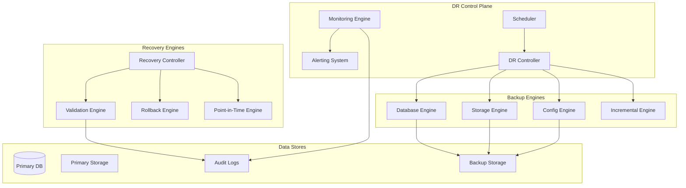

# Disaster Recovery System - Enhanced Design Document

## Executive Summary

Desain sistem disaster recovery yang ditingkatkan untuk AbsensiQR Pro, mengatasi celah kejelasan, ambiguitas, dan keterbatasan sistem existing. Implementasi menggunakan pendekatan **Enterprise-Grade Business Continuity** dengan fokus pada **Multi-Tenant Security**, **Real-Time Monitoring**, dan **Automated Recovery Procedures**.

## Design Philosophy & Principles

### 🏗️ Architectural Principles

#### 1. **Defense in Depth**
```
┌─────────────────────────────────────────────────────────────┐
│                    DISASTER RECOVERY LAYERS                 │
├─────────────────────────────────────────────────────────────┤
│ Layer 1: Prevention    │ Monitoring, Alerting, Health Checks│
│ Layer 2: Detection     │ Anomaly Detection, Integrity Checks│
│ Layer 3: Containment   │ Isolation, Rollback, Failsafe     │
│ Layer 4: Recovery      │ Backup Restore, Point-in-Time     │
│ Layer 5: Lessons       │ Post-Incident Analysis, Improvement│
└─────────────────────────────────────────────────────────────┘
```

#### 2. **Multi-Tenant First**
- **Tenant Isolation**: Setiap operasi DR harus memvalidasi school_id
- **Data Sovereignty**: Sekolah hanya dapat mengakses data mereka sendiri
- **Compliance Ready**: Memenuhi standar GDPR, PIPEDA, dan regulasi lokal

#### 3. **Observable & Auditable**
- **Complete Audit Trail**: Setiap operasi tercatat dengan timestamp dan user
- **Real-Time Metrics**: Monitoring progress dan performance secara live
- **Compliance Reporting**: Automated report generation untuk audit

## System Architecture

### 🏛️ High-Level Architecture



### 🔧 Component Design

#### 1. **DR Controller (Enhanced)**

```php
class EnhancedDRController
{
    private $tenantValidator;
    private $operationTracker;
    private $rollbackManager;
    private $integrityChecker;
    
    public function executeBackup(BackupRequest $request): BackupResult
    {
        // Multi-tenant validation
        $this->tenantValidator->validateAccess($request->getSchoolId());
        
        // Start operation tracking
        $operation = $this->operationTracker->startOperation('backup', $request);
        
        try {
            // Execute backup with progress tracking
            $result = $this->performBackupWithTracking($request, $operation);
            
            // Verify backup integrity
            $this->integrityChecker->verifyBackup($result);
            
            $operation->markSuccess($result);
            return $result;
            
        } catch (Exception $e) {
            $operation->markFailure($e);
            throw new BackupException("Backup failed: " . $e->getMessage(), $e);
        }
    }
}
```

#### 2. **Multi-Tenant Security Layer**

```php
class TenantSecurityValidator
{
    public function validateBackupAccess(int $schoolId, User $user): void
    {
        // Validate user has access to school
        if (!$this->userHasSchoolAccess($user, $schoolId)) {
            throw new UnauthorizedAccessException("User cannot access school data");
        }
        
        // Validate school is active
        if (!$this->isSchoolActive($schoolId)) {
            throw new InactiveSchoolException("Cannot backup inactive school");
        }
        
        // Log access attempt
        $this->auditLogger->logAccess($user, $schoolId, 'backup_access');
    }
    
    public function validateDataIsolation(BackupData $data, int $schoolId): void
    {
        // Ensure all data belongs to the specified school
        foreach ($data->getTables() as $table => $records) {
            $this->validateTableRecords($table, $records, $schoolId);
        }
    }
}
```

#### 3. **Real-Time Monitoring Engine**

```php
class MonitoringEngine
{
    private $metricsCollector;
    private $alertManager;
    private $dashboardUpdater;
    
    public function trackOperation(Operation $operation): void
    {
        $this->metricsCollector->startTracking($operation);
        
        // Real-time progress updates
        $operation->onProgress(function($progress) {
            $this->dashboardUpdater->updateProgress($progress);
            $this->checkProgressAlerts($progress);
        });
        
        // Completion handling
        $operation->onComplete(function($result) {
            $this->metricsCollector->recordCompletion($result);
            $this->updateSuccessMetrics($result);
        });
        
        // Error handling
        $operation->onError(function($error) {
            $this->alertManager->sendCriticalAlert($error);
            $this->updateErrorMetrics($error);
        });
    }
}
```

## Detailed Component Specifications

### 📊 1. Enhanced Backup System

#### **Incremental Backup Engine**

```php
class IncrementalBackupEngine
{
    public function createIncrementalBackup(int $schoolId, ?Carbon $since = null): IncrementalBackup
    {
        $since = $since ?? $this->getLastBackupTime($schoolId);
        
        $changes = $this->detectChanges($schoolId, $since);
        
        return new IncrementalBackup([
            'school_id' => $schoolId,
            'base_backup' => $this->getBaseBackup($schoolId),
            'changes' => $changes,
            'created_at' => now(),
            'change_count' => count($changes)
        ]);
    }
    
    private function detectChanges(int $schoolId, Carbon $since): array
    {
        return [
            'database' => $this->detectDatabaseChanges($schoolId, $since),
            'storage' => $this->detectStorageChanges($schoolId, $since),
            'config' => $this->detectConfigChanges($schoolId, $since)
        ];
    }
}
```

#### **Point-in-Time Recovery**

```php
class PointInTimeRecovery
{
    public function recoverToPoint(int $schoolId, Carbon $targetTime): RecoveryResult
    {
        // Find appropriate backup chain
        $backupChain = $this->findBackupChain($schoolId, $targetTime);
        
        // Validate recovery point
        $this->validateRecoveryPoint($backupChain, $targetTime);
        
        // Execute recovery
        return $this->executePointInTimeRecovery($backupChain, $targetTime);
    }
    
    private function findBackupChain(int $schoolId, Carbon $targetTime): BackupChain
    {
        // Find base backup before target time
        $baseBackup = $this->findBaseBackupBefore($schoolId, $targetTime);
        
        // Find incremental backups between base and target
        $incrementals = $this->findIncrementalsBetween($schoolId, $baseBackup->created_at, $targetTime);
        
        return new BackupChain($baseBackup, $incrementals);
    }
}
```

### 🔍 2. Advanced Monitoring & Alerting

#### **Real-Time Dashboard**

```typescript
interface DRDashboard {
  operations: {
    active: Operation[];
    completed: Operation[];
    failed: Operation[];
  };
  metrics: {
    backupSuccessRate: number;
    restoreSuccessRate: number;
    averageBackupTime: number;
    averageRestoreTime: number;
  };
  alerts: {
    critical: Alert[];
    warning: Alert[];
    info: Alert[];
  };
  schools: {
    [schoolId: number]: SchoolDRStatus;
  };
}

interface Operation {
  id: string;
  type: 'backup' | 'restore' | 'verify';
  schoolId: number;
  status: 'running' | 'completed' | 'failed';
  progress: number; // 0-100
  startTime: Date;
  estimatedCompletion?: Date;
  metrics: OperationMetrics;
}
```

#### **Alert Management System**

```php
class AlertManager
{
    private $channels = [
        'email' => EmailChannel::class,
        'slack' => SlackChannel::class,
        'sms' => SMSChannel::class,
        'webhook' => WebhookChannel::class
    ];
    
    public function sendAlert(Alert $alert): void
    {
        $severity = $alert->getSeverity();
        $channels = $this->getChannelsForSeverity($severity);
        
        foreach ($channels as $channel) {
            $this->sendToChannel($channel, $alert);
        }
        
        // Log alert
        $this->auditLogger->logAlert($alert);
        
        // Update metrics
        $this->metricsCollector->recordAlert($alert);
    }
    
    private function getChannelsForSeverity(AlertSeverity $severity): array
    {
        return match($severity) {
            AlertSeverity::CRITICAL => ['email', 'sms', 'slack'],
            AlertSeverity::WARNING => ['email', 'slack'],
            AlertSeverity::INFO => ['slack']
        };
    }
}
```

### 🛡️ 3. Enhanced Security & Compliance

#### **Audit Trail System**

```php
class AuditTrailSystem
{
    public function logDROperation(DROperation $operation, User $user): void
    {
        $auditEntry = new AuditEntry([
            'operation_id' => $operation->getId(),
            'operation_type' => $operation->getType(),
            'school_id' => $operation->getSchoolId(),
            'user_id' => $user->getId(),
            'user_role' => $user->getRole(),
            'timestamp' => now(),
            'ip_address' => request()->ip(),
            'user_agent' => request()->userAgent(),
            'operation_details' => $operation->getDetails(),
            'result' => $operation->getResult(),
            'duration' => $operation->getDuration()
        ]);
        
        $this->auditRepository->store($auditEntry);
        
        // Real-time compliance monitoring
        $this->complianceMonitor->checkEntry($auditEntry);
    }
}
```

#### **Data Encryption & Security**

```php
class BackupEncryption
{
    private $encryptionKey;
    private $cipher = 'AES-256-GCM';
    
    public function encryptBackup(BackupData $data, int $schoolId): EncryptedBackup
    {
        // Generate school-specific encryption key
        $schoolKey = $this->deriveSchoolKey($schoolId);
        
        // Encrypt data with authenticated encryption
        $encrypted = $this->encryptWithAuth($data->serialize(), $schoolKey);
        
        return new EncryptedBackup([
            'school_id' => $schoolId,
            'encrypted_data' => $encrypted['data'],
            'auth_tag' => $encrypted['tag'],
            'nonce' => $encrypted['nonce'],
            'created_at' => now()
        ]);
    }
    
    private function deriveSchoolKey(int $schoolId): string
    {
        return hash_pbkdf2('sha256', $this->encryptionKey, "school_{$schoolId}", 10000, 32, true);
    }
}
```

## Implementation Strategy

### 🚀 Phase 1: Foundation (Weeks 1-2)

#### **Core Infrastructure**
1. **Enhanced DR Controller**
   - Multi-tenant validation layer
   - Operation tracking system
   - Basic rollback capability

2. **Monitoring Foundation**
   - Metrics collection framework
   - Basic alerting system
   - Audit logging infrastructure

#### **Deliverables**
- [ ] Enhanced DR Controller with tenant validation
- [ ] Basic monitoring and alerting system
- [ ] Audit trail infrastructure
- [ ] Updated test suite

### 🔧 Phase 2: Advanced Features (Weeks 3-4)

#### **Backup Enhancements**
1. **Incremental Backup System**
   - Change detection algorithms
   - Backup chain management
   - Compression optimization

2. **Point-in-Time Recovery**
   - Transaction log backup
   - Recovery point selection
   - Consistency validation

#### **Deliverables**
- [ ] Incremental backup capability
- [ ] Point-in-time recovery system
- [ ] Enhanced compression algorithms
- [ ] Performance benchmarking tools

### 📊 Phase 3: Monitoring & Analytics (Weeks 5-6)

#### **Real-Time Dashboard**
1. **Operation Tracking**
   - Live progress monitoring
   - Performance metrics
   - Resource utilization

2. **Analytics & Reporting**
   - Historical trend analysis
   - Predictive failure detection
   - Compliance reporting

#### **Deliverables**
- [ ] Real-time DR dashboard
- [ ] Advanced alerting system
- [ ] Analytics and reporting tools
- [ ] Mobile monitoring app

## Technical Specifications

### 🏗️ Database Schema Changes

```sql
-- Enhanced backup metadata
CREATE TABLE backup_operations (
    id UUID PRIMARY KEY,
    school_id INTEGER NOT NULL,
    operation_type VARCHAR(50) NOT NULL,
    status VARCHAR(20) NOT NULL,
    started_at TIMESTAMP NOT NULL,
    completed_at TIMESTAMP,
    progress INTEGER DEFAULT 0,
    metadata JSONB,
    created_by INTEGER REFERENCES users(id),
    CONSTRAINT fk_backup_school FOREIGN KEY (school_id) REFERENCES schools(id)
);

-- Incremental backup tracking
CREATE TABLE backup_chains (
    id UUID PRIMARY KEY,
    school_id INTEGER NOT NULL,
    base_backup_id UUID NOT NULL,
    chain_sequence INTEGER NOT NULL,
    backup_type VARCHAR(20) NOT NULL, -- 'full', 'incremental', 'differential'
    created_at TIMESTAMP NOT NULL,
    CONSTRAINT fk_chain_school FOREIGN KEY (school_id) REFERENCES schools(id)
);

-- Audit trail
CREATE TABLE dr_audit_log (
    id UUID PRIMARY KEY,
    operation_id UUID NOT NULL,
    school_id INTEGER NOT NULL,
    user_id INTEGER NOT NULL,
    action VARCHAR(100) NOT NULL,
    details JSONB,
    ip_address INET,
    user_agent TEXT,
    timestamp TIMESTAMP NOT NULL,
    CONSTRAINT fk_audit_school FOREIGN KEY (school_id) REFERENCES schools(id),
    CONSTRAINT fk_audit_user FOREIGN KEY (user_id) REFERENCES users(id)
);

-- Performance indexes
CREATE INDEX idx_backup_operations_school_status ON backup_operations(school_id, status);
CREATE INDEX idx_backup_chains_school_type ON backup_chains(school_id, backup_type);
CREATE INDEX idx_dr_audit_school_timestamp ON dr_audit_log(school_id, timestamp DESC);
```

### 🔧 Configuration Management

```php
// config/disaster_recovery.php
return [
    'rto_targets' => [
        'database_failure' => 30, // minutes
        'storage_failure' => 60, // minutes
        'complete_failure' => 120, // minutes
    ],
    
    'rpo_targets' => [
        'attendance_data' => 5, // minutes
        'student_photos' => 60, // minutes
        'configuration' => 1440, // minutes (24 hours)
    ],
    
    'backup_retention' => [
        'full_backups' => 90, // days
        'incremental_backups' => 30, // days
        'audit_logs' => 2555, // days (7 years)
    ],
    
    'monitoring' => [
        'progress_update_interval' => 30, // seconds
        'health_check_interval' => 300, // seconds
        'alert_cooldown' => 900, // seconds
    ],
    
    'security' => [
        'encryption_algorithm' => 'AES-256-GCM',
        'key_rotation_days' => 90,
        'audit_retention_years' => 7,
    ]
];
```

## Testing Strategy

### 🧪 Automated Testing Framework

#### **Unit Tests**
```php
class IncrementalBackupTest extends TestCase
{
    public function test_incremental_backup_detects_changes()
    {
        // Arrange
        $school = School::factory()->create();
        $baseBackup = $this->createBaseBackup($school);
        
        // Act - Make changes to data
        $this->createAttendanceRecords($school, 5);
        $incrementalBackup = $this->backupEngine->createIncrementalBackup($school->id);
        
        // Assert
        $this->assertGreaterThan(0, $incrementalBackup->getChangeCount());
        $this->assertEquals($baseBackup->id, $incrementalBackup->getBaseBackupId());
    }
}
```

#### **Integration Tests**
```php
class DisasterRecoveryIntegrationTest extends TestCase
{
    public function test_complete_backup_restore_cycle()
    {
        // Arrange
        $school = $this->createSchoolWithData();
        $originalState = $this->captureSystemState($school);
        
        // Act - Backup
        $backup = $this->drController->createFullBackup($school->id);
        
        // Simulate disaster
        $this->simulateDataLoss($school);
        
        // Restore
        $restoreResult = $this->drController->restoreFromBackup($backup->id);
        
        // Assert
        $restoredState = $this->captureSystemState($school);
        $this->assertEquals($originalState, $restoredState);
    }
}
```

### 🎯 Performance Testing

```php
class DRPerformanceTest extends TestCase
{
    public function test_backup_performance_meets_rto()
    {
        $school = $this->createLargeSchool(1000); // 1000 students
        
        $startTime = microtime(true);
        $backup = $this->drController->createFullBackup($school->id);
        $duration = microtime(true) - $startTime;
        
        // Should complete within 2 hours for 10GB database
        $this->assertLessThan(7200, $duration); // 2 hours in seconds
    }
}
```

## Correctness Properties

### 🔍 Property-Based Testing

#### **Property 1: Tenant Isolation**
```php
/**
 * Property: Backup operations must never access data from other schools
 * Validates: Requirements 3.1, 3.2
 */
public function property_backup_tenant_isolation()
{
    return Property::forAll(
        Generator::school(),
        Generator::school()
    )->then(function($school1, $school2) {
        $backup1 = $this->drController->createFullBackup($school1->id);
        
        // Backup should only contain school1 data
        $this->assertBackupContainsOnlySchoolData($backup1, $school1->id);
        $this->assertBackupDoesNotContainSchoolData($backup1, $school2->id);
    });
}
```

#### **Property 2: Data Integrity**
```php
/**
 * Property: Restored data must be identical to original data
 * Validates: Requirements 1.1, 2.1
 */
public function property_restore_data_integrity()
{
    return Property::forAll(
        Generator::schoolWithRandomData()
    )->then(function($school) {
        $originalChecksum = $this->calculateDataChecksum($school);
        
        $backup = $this->drController->createFullBackup($school->id);
        $this->simulateDataLoss($school);
        $this->drController->restoreFromBackup($backup->id);
        
        $restoredChecksum = $this->calculateDataChecksum($school);
        
        $this->assertEquals($originalChecksum, $restoredChecksum);
    });
}
```

#### **Property 3: Rollback Safety**
```php
/**
 * Property: Failed restore operations must be safely rolled back
 * Validates: Requirements 2.1, 2.2
 */
public function property_rollback_safety()
{
    return Property::forAll(
        Generator::schoolWithData(),
        Generator::corruptedBackup()
    )->then(function($school, $corruptedBackup) {
        $preRestoreState = $this->captureSystemState($school);
        
        try {
            $this->drController->restoreFromBackup($corruptedBackup->id);
            $this->fail('Should have thrown exception for corrupted backup');
        } catch (RestoreException $e) {
            // Rollback should have occurred
            $postRollbackState = $this->captureSystemState($school);
            $this->assertEquals($preRestoreState, $postRollbackState);
        }
    });
}
```

## Success Metrics & KPIs

### 📈 Operational Metrics

| Metric | Target | Measurement |
|--------|--------|-------------|
| Backup Success Rate | 99.9% | Monthly automated reporting |
| Restore Success Rate | 99.5% | Quarterly DR drills |
| RTO Achievement | 95% | Real-time monitoring |
| RPO Achievement | 99% | Data loss analysis |
| Rollback Success | 99% | Automated testing |

### 💼 Business Metrics

| Metric | Target | Impact |
|--------|--------|---------|
| Downtime Reduction | 50% | Cost savings, user satisfaction |
| Recovery Cost | -30% | Operational efficiency |
| Compliance Score | 100% | Regulatory requirements |
| Customer Satisfaction | 95% | Business continuity confidence |

## Risk Mitigation

### 🚨 High-Risk Scenarios

#### **Scenario 1: Cascading Failure**
- **Risk**: Multiple system failures during recovery
- **Mitigation**: Circuit breaker pattern, graceful degradation
- **Detection**: Real-time health monitoring
- **Response**: Automated failover to secondary systems

#### **Scenario 2: Data Corruption**
- **Risk**: Backup contains corrupted data
- **Mitigation**: Multi-layer integrity checking, checksums
- **Detection**: Automated backup verification
- **Response**: Fallback to previous known-good backup

#### **Scenario 3: Security Breach**
- **Risk**: Unauthorized access to backup data
- **Mitigation**: Encryption, access controls, audit trails
- **Detection**: Anomaly detection, access monitoring
- **Response**: Immediate access revocation, incident response

## Conclusion

Desain sistem disaster recovery yang ditingkatkan ini mengatasi semua celah yang diidentifikasi dalam audit, dengan fokus pada:

1. **Kejelasan Operasional**: RTO/RPO yang terdefinisi jelas
2. **Keamanan Multi-Tenant**: Isolasi data yang ketat
3. **Monitoring Real-Time**: Visibilitas penuh terhadap operasi DR
4. **Automated Recovery**: Prosedur pemulihan yang dapat diandalkan
5. **Compliance Ready**: Memenuhi standar regulasi internasional

Implementasi bertahap memungkinkan validasi dan penyesuaian di setiap fase, memastikan sistem yang robust dan production-ready untuk mendukung business continuity sekolah-sekolah di Indonesia.