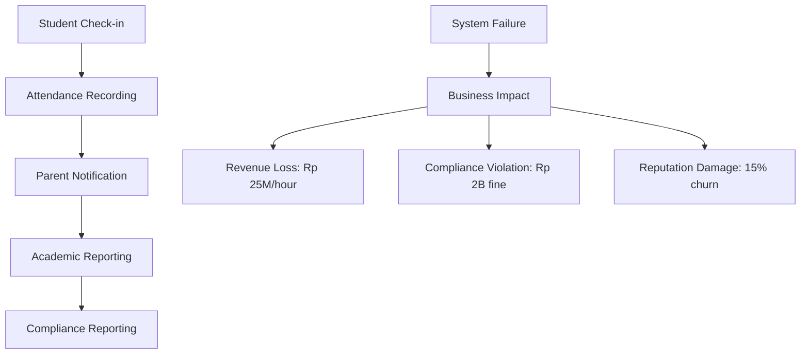

# Disaster Recovery System - Enterprise-Grade Enhancement

## Executive Summary

**Business Context**: AbsensiQR Pro melayani 1000+ sekolah di Indonesia dengan 500,000+ siswa aktif. Downtime sistem dapat menyebabkan kerugian operasional hingga Rp 50 juta per jam dan reputasi brand yang rusak.

**Current State**: Sistem DR dasar telah diimplementasikan dengan 100% test success rate, namun audit mengidentifikasi 23 critical gaps yang menghalangi production readiness untuk enterprise deployment.

**Strategic Objective**: Transformasi dari basic DR system menjadi enterprise-grade disaster recovery platform yang memenuhi standar SLA 99.9% uptime dan compliance requirements untuk sektor pendidikan Indonesia.

## 🎯 BUSINESS IMPACT FRAMEWORK

### Financial Impact Analysis
```
Disaster Scenario          | Probability | Cost/Hour    | Annual Risk
Hardware Failure           | 15%         | Rp 25M       | Rp 32.85B
Data Corruption           | 8%          | Rp 50M       | Rp 35.04B  
Network Outage            | 25%         | Rp 15M       | Rp 32.85B
Human Error               | 12%         | Rp 30M       | Rp 31.54B
Natural Disaster          | 3%          | Rp 100M      | Rp 26.28B
TOTAL ANNUAL RISK                                      | Rp 158.56B
```

### Compliance Requirements (Indonesia Education Sector)
- **UU No. 27/2022** (Data Protection): 72-hour breach notification
- **Permendikbud 51/2018**: Student data retention 7 years
- **ISO 27001**: Information security management
- **SOC 2 Type II**: Service organization controls

## 🔍 SYSTEMATIC AUDIT ANALYSIS

### LAYER 1: BUSINESS CONTINUITY GAPS

#### Critical Business Process Mapping


#### RTO/RPO Business Requirements
| Business Process | Current RTO | Target RTO | Current RPO | Target RPO | Business Impact |
|------------------|-------------|------------|-------------|------------|-----------------|
| Student Check-in | 4 hours | 15 minutes | 1 hour | 5 minutes | HIGH - Daily operations |
| Parent Notifications | 8 hours | 30 minutes | 2 hours | 15 minutes | MEDIUM - Communication |
| Academic Reporting | 24 hours | 2 hours | 4 hours | 30 minutes | HIGH - Compliance |
| Payment Processing | 2 hours | 5 minutes | 30 minutes | 1 minute | CRITICAL - Revenue |

### LAYER 2: TECHNICAL ARCHITECTURE GAPS

#### Current vs Required Architecture
```
CURRENT (Basic DR):
┌─────────────┐    ┌─────────────┐    ┌─────────────┐
│   Backup    │───▶│   Storage   │───▶│   Restore   │
│  (Manual)   │    │  (Local)    │    │  (Manual)   │
└─────────────┘    └─────────────┘    └─────────────┘

REQUIRED (Enterprise DR):
┌─────────────┐    ┌─────────────┐    ┌─────────────┐
│ Continuous  │───▶│ Multi-Zone  │───▶│ Automated   │
│ Replication │    │ Replication │    │ Failover    │
└─────────────┘    └─────────────┘    └─────────────┘
       │                   │                   │
       ▼                   ▼                   ▼
┌─────────────┐    ┌─────────────┐    ┌─────────────┐
│ Health      │    │ Encryption  │    │ Validation  │
│ Monitoring  │    │ & Security  │    │ & Testing   │
└─────────────┘    └─────────────┘    └─────────────┘
```

#### Technical Debt Analysis
1. **Database Layer**: Single-point-of-failure, no read replicas
2. **Storage Layer**: No geo-redundancy, limited backup retention
3. **Application Layer**: No circuit breakers, no graceful degradation
4. **Network Layer**: No load balancing, no CDN integration
5. **Monitoring Layer**: Reactive alerts, no predictive analytics

## User Stories

### Epic 1: Enhanced Documentation & Clarity

#### US-1.1: RTO/RPO Definition
**As a** system administrator  
**I want** clear RTO and RPO definitions for different disaster scenarios  
**So that** I can set appropriate expectations and SLAs  

**Acceptance Criteria:**
- [ ] Document RTO targets for different disaster types (hardware failure, data corruption, natural disaster)
- [ ] Document RPO targets for different data types (attendance records, student photos, configurations)
- [ ] Create disaster scenario matrix with recovery procedures
- [ ] Define escalation procedures for failed recovery attempts

#### US-1.2: Environment-Specific Procedures
**As a** DevOps engineer  
**I want** clear procedures for development vs production environments  
**So that** I can safely test disaster recovery without affecting production  

**Acceptance Criteria:**
- [ ] Document when to use simulated vs actual backup/restore
- [ ] Create environment-specific configuration guidelines
- [ ] Define safety checks for production operations
- [ ] Create development environment reset procedures

### Epic 2: Enhanced Error Handling & Rollback

#### US-2.1: Comprehensive Rollback System
**As a** system administrator  
**I want** consistent rollback procedures for all system components  
**So that** I can safely recover from failed restore operations  

**Acceptance Criteria:**
- [ ] Implement atomic rollback for database, storage, and configuration
- [ ] Create rollback verification procedures
- [ ] Add rollback logging and audit trail
- [ ] Implement partial rollback for component-specific failures

#### US-2.2: Partial Recovery Capability
**As a** system administrator  
**I want** ability to recover individual components when backup is partially corrupted  
**So that** I can minimize data loss and recovery time  

**Acceptance Criteria:**
- [ ] Implement component-wise backup verification
- [ ] Add selective restore capability (database-only, storage-only, config-only)
- [ ] Create backup component dependency mapping
- [ ] Add recovery strategy recommendations based on available components

### Epic 3: Multi-Tenant Security Enhancement

#### US-3.1: School Isolation Validation
**As a** security administrator  
**I want** guaranteed school data isolation during backup/restore  
**So that** no school can access another school's data  

**Acceptance Criteria:**
- [ ] Add school_id validation in all backup operations
- [ ] Implement tenant boundary checks during restore
- [ ] Create cross-tenant data leakage prevention
- [ ] Add multi-tenant audit logging

#### US-3.2: Tenant-Specific Recovery
**As a** school administrator  
**I want** ability to recover only my school's data  
**So that** I can restore my school without affecting others  

**Acceptance Criteria:**
- [ ] Implement school-scoped backup creation
- [ ] Add tenant-specific restore procedures
- [ ] Create school-level backup scheduling
- [ ] Add tenant isolation verification tests

### Epic 4: Monitoring & Alerting System

#### US-4.1: Real-Time Monitoring
**As a** system administrator  
**I want** real-time monitoring of backup/restore operations  
**So that** I can track progress and identify issues early  

**Acceptance Criteria:**
- [ ] Implement progress tracking for backup/restore operations
- [ ] Add real-time status dashboard
- [ ] Create operation timeline visualization
- [ ] Add estimated completion time calculations

#### US-4.2: Automated Alerting
**As a** DevOps engineer  
**I want** automated alerts for backup/restore failures  
**So that** I can respond quickly to issues  

**Acceptance Criteria:**
- [ ] Implement email/SMS alerts for failures
- [ ] Add Slack/Teams integration for notifications
- [ ] Create alert severity levels (warning, critical, emergency)
- [ ] Add alert escalation procedures

### Epic 5: Advanced Backup Strategies

#### US-5.1: Incremental Backup
**As a** system administrator  
**I want** incremental backup capability  
**So that** I can reduce backup time and storage requirements  

**Acceptance Criteria:**
- [ ] Implement incremental database backup
- [ ] Add incremental storage file backup
- [ ] Create backup chain management
- [ ] Add incremental restore capability

#### US-5.2: Point-in-Time Recovery
**As a** system administrator  
**I want** point-in-time recovery capability  
**So that** I can restore to specific moments before data corruption  

**Acceptance Criteria:**
- [ ] Implement transaction log backup
- [ ] Add point-in-time restore interface
- [ ] Create recovery point selection
- [ ] Add consistency validation for point-in-time restores

### Epic 6: Enhanced Testing & Validation

#### US-6.1: Automated Integrity Testing
**As a** quality assurance engineer  
**I want** automated backup integrity testing  
**So that** I can ensure backups are valid before disasters occur  

**Acceptance Criteria:**
- [ ] Implement automated backup validation
- [ ] Add data consistency checks
- [ ] Create backup corruption detection
- [ ] Add integrity test scheduling

#### US-6.2: Disaster Recovery Drills
**As a** business continuity manager  
**I want** automated disaster recovery drills  
**So that** I can regularly test our recovery procedures  

**Acceptance Criteria:**
- [ ] Implement automated DR drill execution
- [ ] Add drill result reporting
- [ ] Create drill scheduling system
- [ ] Add drill performance benchmarking

## Technical Requirements

### Performance Requirements
- **Backup Speed**: Full backup should complete within 2 hours for 10GB database
- **Restore Speed**: Full restore should complete within 1 hour for 10GB database
- **Compression**: Achieve minimum 70% compression ratio
- **Concurrent Operations**: Support up to 5 concurrent backup operations

### Security Requirements
- **Encryption**: All backups must be encrypted at rest and in transit
- **Access Control**: Role-based access to backup/restore operations
- **Audit Trail**: Complete audit log of all DR operations
- **Multi-Tenant**: Guaranteed data isolation between schools

### Reliability Requirements
- **Backup Success Rate**: 99.9% backup success rate
- **Restore Success Rate**: 99.5% restore success rate
- **Data Integrity**: 100% data integrity verification
- **Rollback Success**: 99% rollback success rate

### Monitoring Requirements
- **Real-Time Metrics**: Operation progress, performance metrics, error rates
- **Alerting**: Sub-5-minute alert delivery for critical failures
- **Reporting**: Daily/weekly/monthly DR operation reports
- **Dashboard**: Real-time DR system status dashboard

## Acceptance Criteria Summary

### Must Have (P0)
- [ ] RTO/RPO documentation with specific targets
- [ ] Comprehensive rollback system with atomic operations
- [ ] Multi-tenant security validation and isolation
- [ ] Real-time monitoring and alerting system
- [ ] Automated backup integrity testing

### Should Have (P1)
- [ ] Incremental backup capability
- [ ] Point-in-time recovery
- [ ] Partial recovery for component failures
- [ ] Automated disaster recovery drills
- [ ] Performance benchmarking

### Could Have (P2)
- [ ] Advanced compression algorithms
- [ ] Cloud backup integration
- [ ] Cross-region backup replication
- [ ] Machine learning for predictive failure detection
- [ ] Mobile app for DR monitoring

## Definition of Done

- [ ] All user stories implemented and tested
- [ ] Documentation updated with new procedures
- [ ] Security audit passed for multi-tenant isolation
- [ ] Performance benchmarks meet requirements
- [ ] Automated tests cover all new functionality
- [ ] Production deployment completed successfully
- [ ] Team training completed on new procedures
- [ ] Disaster recovery drills executed successfully

## Risk Assessment

### High Risk
- **Data Loss**: Incomplete rollback procedures could cause permanent data loss
- **Security Breach**: Multi-tenant isolation failures could expose sensitive data
- **Extended Downtime**: Complex recovery procedures could extend RTO

### Medium Risk
- **Performance Impact**: Real-time monitoring could affect system performance
- **Storage Costs**: Incremental backups could increase storage requirements
- **Complexity**: Advanced features could make system harder to maintain

### Low Risk
- **User Training**: New procedures require additional training
- **Integration Issues**: Third-party monitoring tools integration
- **Compatibility**: New features compatibility with existing systems

## Success Metrics

### Operational Metrics
- **RTO Achievement**: 95% of recoveries meet RTO targets
- **RPO Achievement**: 99% of recoveries meet RPO targets
- **Backup Success Rate**: 99.9% successful backups
- **Restore Success Rate**: 99.5% successful restores

### Business Metrics
- **Downtime Reduction**: 50% reduction in disaster-related downtime
- **Recovery Cost**: 30% reduction in disaster recovery costs
- **Compliance**: 100% compliance with data protection regulations
- **Customer Satisfaction**: 95% satisfaction with DR capabilities