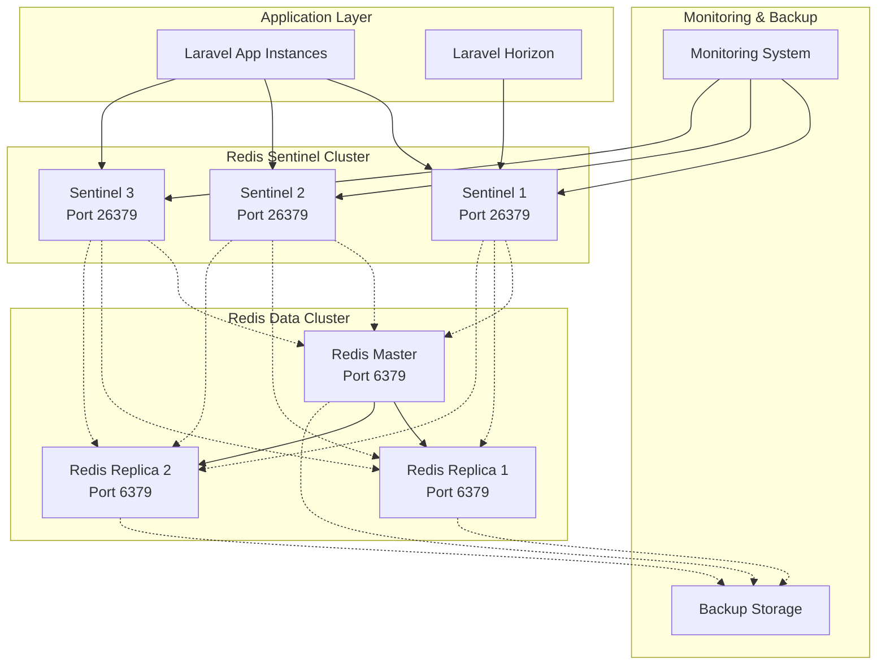

# Design Document: Redis High Availability

## Overview

This design implements Redis High Availability for AbsensiQR Pro using Redis Sentinel architecture to eliminate the single point of failure in the current Redis infrastructure. The solution provides automatic failover, persistent storage, and monitoring capabilities while maintaining multi-tenant session isolation and supporting Laravel's session, cache, and queue systems.

The architecture uses Redis Sentinel for monitoring and automatic failover, with a master-replica topology that ensures 99.9% availability and sub-30-second failover times. The design integrates seamlessly with Laravel's existing Redis usage patterns while adding resilience and monitoring capabilities.

## Architecture

### High-Level Architecture



### Deployment Architecture

The Redis HA cluster consists of:

- **3 Redis Sentinel nodes**: Monitor cluster health and coordinate failover
- **1 Redis Master node**: Handles all write operations
- **2 Redis Replica nodes**: Replicate master data and serve as failover candidates
- **Laravel Application Integration**: Uses Predis client with Sentinel support

### Network Configuration

- **Sentinel Ports**: 26379 (standard Sentinel port)
- **Redis Ports**: 6379 (standard Redis port)
- **Service Discovery**: Sentinels provide master discovery to applications
- **Quorum**: Minimum 2 Sentinels must agree for failover decisions

## Components and Interfaces

### Redis Sentinel Configuration

**Sentinel Configuration (`sentinel.conf`)**:
```conf
# Basic Sentinel configuration
port 26379
sentinel monitor mymaster <master-ip> 6379 2
sentinel down-after-milliseconds mymaster 5000
sentinel failover-timeout mymaster 30000
sentinel parallel-syncs mymaster 1
sentinel auth-pass mymaster <redis-password>

# Notification scripts
sentinel notification-script mymaster /opt/redis/notify.sh
sentinel client-reconfig-script mymaster /opt/redis/reconfig.sh
```

**Key Configuration Parameters**:
- `quorum: 2`: Minimum Sentinels needed to agree on master failure
- `down-after-milliseconds: 5000`: Time before marking master as down
- `failover-timeout: 30000`: Maximum time for failover completion
- `parallel-syncs: 1`: Number of replicas to sync simultaneously

### Laravel Redis Configuration

**Database Configuration (`config/database.php`)**:
```php
'redis' => [
    'client' => env('REDIS_CLIENT', 'predis'),
    
    'options' => [
        'prefix' => Str::slug(env('APP_NAME', 'absensi_qr_pro'), '_') . '_',
    ],
    
    'default' => env('REDIS_SENTINELS', false) ? [
        'tcp://sentinel-1:26379?timeout=0.1',
        'tcp://sentinel-2:26379?timeout=0.1', 
        'tcp://sentinel-3:26379?timeout=0.1',
        'options' => [
            'replication' => 'sentinel',
            'service' => 'mymaster',
            'parameters' => [
                'database' => 0,
                'password' => env('REDIS_PASSWORD'),
            ],
        ],
    ] : [
        'host' => env('REDIS_HOST', '127.0.0.1'),
        'password' => env('REDIS_PASSWORD'),
        'port' => env('REDIS_PORT', 6379),
        'database' => 0,
    ],
    
    'cache' => env('REDIS_SENTINELS', false) ? [
        'tcp://sentinel-1:26379?timeout=0.1',
        'tcp://sentinel-2:26379?timeout=0.1',
        'tcp://sentinel-3:26379?timeout=0.1', 
        'options' => [
            'replication' => 'sentinel',
            'service' => 'mymaster',
            'parameters' => [
                'database' => 1,
                'password' => env('REDIS_PASSWORD'),
            ],
        ],
    ] : [
        'host' => env('REDIS_HOST', '127.0.0.1'),
        'password' => env('REDIS_PASSWORD'),
        'port' => env('REDIS_PORT', 6379),
        'database' => 1,
    ],
    
    'session' => env('REDIS_SENTINELS', false) ? [
        'tcp://sentinel-1:26379?timeout=0.1',
        'tcp://sentinel-2:26379?timeout=0.1',
        'tcp://sentinel-3:26379?timeout=0.1',
        'options' => [
            'replication' => 'sentinel', 
            'service' => 'mymaster',
            'parameters' => [
                'database' => 2,
                'password' => env('REDIS_PASSWORD'),
            ],
        ],
    ] : [
        'host' => env('REDIS_HOST', '127.0.0.1'),
        'password' => env('REDIS_PASSWORD'),
        'port' => env('REDIS_PORT', 6379),
        'database' => 2,
    ],
],
```

### Session Management Component

**Multi-Tenant Session Handler**:
```php
class TenantAwareSessionHandler implements SessionHandlerInterface
{
    private $redis;
    private $keyPrefix;
    
    public function __construct($redis, $keyPrefix = 'session')
    {
        $this->redis = $redis;
        $this->keyPrefix = $keyPrefix;
    }
    
    public function read($sessionId)
    {
        $tenantId = $this->getCurrentTenantId();
        $key = $this->buildKey($tenantId, $sessionId);
        return $this->redis->get($key) ?: '';
    }
    
    public function write($sessionId, $sessionData)
    {
        $tenantId = $this->getCurrentTenantId();
        $key = $this->buildKey($tenantId, $sessionId);
        $ttl = config('session.lifetime') * 60;
        return $this->redis->setex($key, $ttl, $sessionData);
    }
    
    private function buildKey($tenantId, $sessionId)
    {
        return "{$this->keyPrefix}:tenant:{$tenantId}:session:{$sessionId}";
    }
}
```

### Cache Warming Component

**Cache Warming Service**:
```php
class CacheWarmingService
{
    private $cache;
    private $warmingStrategies;
    
    public function warmCache()
    {
        foreach ($this->warmingStrategies as $strategy) {
            $strategy->warm();
        }
    }
    
    public function registerWarmingStrategy(WarmingStrategyInterface $strategy)
    {
        $this->warmingStrategies[] = $strategy;
    }
}

interface WarmingStrategyInterface
{
    public function warm(): void;
    public function getPriority(): int;
}

class SchoolDataWarmingStrategy implements WarmingStrategyInterface
{
    public function warm(): void
    {
        // Warm frequently accessed school data
        $schools = School::active()->get();
        foreach ($schools as $school) {
            Cache::remember("school:{$school->id}:config", 3600, function() use ($school) {
                return $school->configuration;
            });
        }
    }
}
```

### Queue Recovery Component

**Queue Recovery Service**:
```php
class QueueRecoveryService
{
    private $redis;
    private $queueManager;
    
    public function recoverFailedJobs()
    {
        $failedJobs = $this->getFailedJobs();
        
        foreach ($failedJobs as $job) {
            if ($this->shouldRetry($job)) {
                $this->requeueJob($job);
            }
        }
    }
    
    public function ensureIdempotency($job)
    {
        $jobId = $this->generateJobId($job);
        $lockKey = "job_lock:{$jobId}";
        
        return $this->redis->set($lockKey, 1, 'EX', 300, 'NX');
    }
    
    private function shouldRetry($job)
    {
        return $job['attempts'] < config('queue.max_attempts', 3);
    }
}
```

## Data Models

### Redis Data Structure Organization

**Database Allocation**:
- Database 0: Default/General purpose data
- Database 1: Cache data
- Database 2: Session data  
- Database 3: Queue data
- Database 4: Tenant-specific data

**Key Naming Conventions**:
```
# Session keys
session:tenant:{tenant_id}:session:{session_id}

# Cache keys  
cache:tenant:{tenant_id}:{cache_key}
cache:global:{cache_key}

# Queue keys
queue:tenant:{tenant_id}:{queue_name}
queue:failed:tenant:{tenant_id}

# Monitoring keys
health:sentinel:{sentinel_id}
health:redis:{redis_id}
metrics:failover:{timestamp}
```

### Configuration Data Model

**Sentinel Configuration Model**:
```php
class SentinelConfiguration
{
    public string $serviceName = 'mymaster';
    public array $sentinelHosts;
    public int $quorum = 2;
    public int $downAfterMilliseconds = 5000;
    public int $failoverTimeout = 30000;
    public int $parallelSyncs = 1;
    public ?string $authPassword;
    public array $notificationScripts = [];
    public array $reconfigScripts = [];
}
```

**Health Check Data Model**:
```php
class RedisHealthStatus
{
    public string $nodeId;
    public string $nodeType; // 'master', 'replica', 'sentinel'
    public string $status; // 'up', 'down', 'degraded'
    public int $lastSeen;
    public ?int $replicationLag;
    public array $metrics;
    public ?string $errorMessage;
}
```

### Backup Data Model

**Backup Metadata**:
```php
class RedisBackup
{
    public string $backupId;
    public DateTime $timestamp;
    public string $backupType; // 'full', 'incremental'
    public int $dataSize;
    public string $storageLocation;
    public array $includedDatabases;
    public string $checksum;
    public bool $verified;
}
```

## Correctness Properties

*A property is a characteristic or behavior that should hold true across all valid executions of a system-essentially, a formal statement about what the system should do. Properties serve as the bridge between human-readable specifications and machine-verifiable correctness guarantees.*

Before writing the correctness properties, I need to analyze the acceptance criteria from the requirements document to determine which ones are testable as properties.

### Acceptance Criteria Testing Prework

Based on the requirements analysis, I've identified which acceptance criteria are testable as properties, examples, or edge cases. Most criteria are testable as properties since they describe universal behaviors that should hold across all valid system states and inputs.

### Converting EARS to Properties

**Property 1: Failover timing compliance**
*For any* Redis master failure scenario, the Failover_Manager should promote a replica to master within 30 seconds
**Validates: Requirements 1.1**

**Property 2: Connection redirection during failover**
*For any* failover event, all application connections should be automatically redirected to the new master without manual intervention
**Validates: Requirements 1.2**

**Property 3: Split-brain prevention**
*For any* recovered original master, it should be configured as a replica to prevent multiple masters
**Validates: Requirements 1.3**

**Property 4: Replica availability invariant**
*For any* cluster state, at least one replica node should be available for failover capability
**Validates: Requirements 1.4**

**Property 5: Quorum-based master election**
*For any* network partition scenario, only one master should exist based on quorum decisions
**Validates: Requirements 1.5**

**Property 6: Session preservation during failover**
*For any* active user session, it should remain accessible and valid after Redis failover without data loss
**Validates: Requirements 2.1**

**Property 7: Session continuity during failover**
*For any* user request made during failover, session validity and authentication state should be maintained
**Validates: Requirements 2.2**

**Property 8: Session persistence across restarts**
*For any* user session, it should survive Redis restarts and failovers through persistent storage
**Validates: Requirements 2.3**

**Property 9: Multi-tenant isolation preservation**
*For any* failover event, tenant-based session separation should be maintained without cross-tenant access
**Validates: Requirements 2.4, 5.4**

**Property 10: Session expiration after failover**
*For any* session with configured timeout, expiration should work correctly even after failover events
**Validates: Requirements 2.5**

**Property 11: Queue job preservation**
*For any* pending background job, it should be preserved without loss during Redis failover
**Validates: Requirements 3.1**

**Property 12: Queue processing resumption timing**
*For any* failover completion, job processing should resume within 1 minute of new master availability
**Validates: Requirements 3.2**

**Property 13: Job retry mechanism**
*For any* job interrupted during failover, retry mechanisms should handle failed jobs appropriately
**Validates: Requirements 3.3**

**Property 14: Job priority preservation**
*For any* queued job with priority, the priority and scheduling should be maintained after failover
**Validates: Requirements 3.4**

**Property 15: Job idempotency**
*For any* potential duplicate job scenario during failover, idempotency checks should prevent duplicate execution
**Validates: Requirements 3.5**

**Property 16: Cache warming after failover**
*For any* Redis failover, cache warming should restore frequently accessed data automatically
**Validates: Requirements 4.1**

**Property 17: Cache hit ratio recovery**
*For any* failover completion, cache hit ratio should reach above 80% within 5 minutes
**Validates: Requirements 4.2**

**Property 18: Graceful cache degradation**
*For any* cache miss during failover, the system should gracefully degrade to database queries without errors
**Validates: Requirements 4.3**

**Property 19: Cache key distribution optimization**
*For any* cache key, distribution strategies should optimize performance across replica nodes
**Validates: Requirements 4.4**

**Property 20: Cache consistency management**
*For any* inconsistent cache data after failover, invalidation and refresh mechanisms should restore consistency
**Validates: Requirements 4.5**

**Property 21: Tenant namespace isolation**
*For any* school tenant data, namespace isolation should be maintained for sessions, cache, and queue data
**Validates: Requirements 5.1, 5.3**

**Property 22: Cross-tenant access prevention**
*For any* failover event, cross-tenant data access or leakage should be prevented
**Validates: Requirements 5.2**

**Property 23: Cross-tenant access auditing**
*For any* cross-tenant access attempt during failover, it should be audited and logged
**Validates: Requirements 5.5**

**Property 24: Health monitoring frequency**
*For any* configured check interval, Redis node health monitoring should occur at the specified frequency
**Validates: Requirements 6.1**

**Property 25: Pre-failover alerting**
*For any* Redis node showing degraded performance, alerts should be sent before automatic failover
**Validates: Requirements 6.2**

**Property 26: Failover event tracking**
*For any* failover event, it should be tracked and reported with timestamps and root cause analysis
**Validates: Requirements 6.3**

**Property 27: Replication lag monitoring**
*For any* replication lag exceeding 10 seconds, alerts should be triggered
**Validates: Requirements 6.4**

**Property 28: Health status endpoint availability**
*For any* external monitoring system request, health status endpoints should provide proper status information
**Validates: Requirements 6.5**

**Property 29: Automated backup execution**
*For any* day, automated backups of all persistent data should be performed
**Validates: Requirements 7.1**

**Property 30: Backup performance isolation**
*For any* backup operation, production performance and availability should not be impacted
**Validates: Requirements 7.2**

**Property 31: Backup retention and recovery**
*For any* backup created, it should be retained for 30 days with point-in-time recovery capability
**Validates: Requirements 7.3**

**Property 32: Disaster recovery timing**
*For any* disaster recovery scenario, restoration from backup should complete within 15 minutes
**Validates: Requirements 7.4**

**Property 33: Backup integrity verification**
*For any* backup created, integrity should be verified through automated testing procedures
**Validates: Requirements 7.5**

**Property 34: Zero-downtime configuration updates**
*For any* configuration change, it should be applied without service interruption
**Validates: Requirements 8.2**

**Property 35: Rolling update availability**
*For any* Redis version upgrade, rolling updates should maintain availability without downtime
**Validates: Requirements 8.4**

**Property 36: Automated rollback capability**
*For any* deployment issue, automated rollback should restore service functionality
**Validates: Requirements 8.5**

**Property 37: Concurrent session capacity**
*For any* load scenario, the system should support minimum 10,000 concurrent sessions across all tenants
**Validates: Requirements 9.1**

**Property 38: Cache operation performance**
*For any* cache operation load, the system should handle minimum 1,000 operations per second with sub-millisecond response times
**Validates: Requirements 9.2**

**Property 39: Queue processing throughput**
*For any* background job load, the system should process minimum 500 jobs per minute
**Validates: Requirements 9.3**

**Property 40: Horizontal scaling capability**
*For any* increased load scenario, the system should scale horizontally by adding replica nodes
**Validates: Requirements 9.4**

**Property 41: Authentication enforcement**
*For any* client connection attempt, authentication with strong passwords should be required
**Validates: Requirements 10.1**

**Property 42: Data encryption in transit**
*For any* inter-node communication, data should be encrypted using TLS
**Validates: Requirements 10.2**

**Property 43: Data encryption at rest**
*For any* sensitive data including session tokens, encryption at rest should be implemented
**Validates: Requirements 10.3**

**Property 44: Administrative action auditing**
*For any* administrative access or configuration change, it should be logged for audit purposes
**Validates: Requirements 10.4**

**Property 45: Security breach response**
*For any* detected security breach, automatic access revocation and alerting should be implemented
**Validates: Requirements 10.5**

## Error Handling

### Failover Error Scenarios

**Master Node Failure**:
- Sentinel detects master unavailability within 5 seconds
- Quorum agreement required before failover initiation
- Replica promotion with automatic client redirection
- Failed master marked as down until manual intervention

**Network Partition Handling**:
- Quorum-based decisions prevent split-brain scenarios
- Minority partition nodes become read-only
- Automatic recovery when partition heals
- Client connection redistribution

**Replica Synchronization Errors**:
- Automatic retry with exponential backoff
- Alert generation for persistent sync failures
- Fallback to remaining healthy replicas
- Manual intervention triggers for critical failures

### Application Integration Error Handling

**Connection Pool Management**:
```php
class ResilientRedisConnection
{
    private $sentinels;
    private $connectionPool;
    private $maxRetries = 3;
    
    public function execute($command, $args = [])
    {
        $attempts = 0;
        
        while ($attempts < $this->maxRetries) {
            try {
                $connection = $this->getHealthyConnection();
                return $connection->executeCommand($command, $args);
            } catch (ConnectionException $e) {
                $attempts++;
                $this->invalidateConnection($connection);
                
                if ($attempts >= $this->maxRetries) {
                    throw new RedisUnavailableException(
                        "Redis unavailable after {$this->maxRetries} attempts"
                    );
                }
                
                usleep(100000 * $attempts); // Exponential backoff
            }
        }
    }
}
```

**Session Fallback Strategy**:
```php
class FallbackSessionHandler implements SessionHandlerInterface
{
    private $primaryHandler;
    private $fallbackHandler; // Database-based fallback
    
    public function read($sessionId)
    {
        try {
            return $this->primaryHandler->read($sessionId);
        } catch (RedisException $e) {
            Log::warning('Redis session read failed, using database fallback', [
                'session_id' => $sessionId,
                'error' => $e->getMessage()
            ]);
            
            return $this->fallbackHandler->read($sessionId);
        }
    }
}
```

### Queue Error Recovery

**Job Recovery Mechanism**:
```php
class QueueRecoveryService
{
    public function recoverInterruptedJobs()
    {
        $interruptedJobs = $this->findInterruptedJobs();
        
        foreach ($interruptedJobs as $job) {
            if ($this->shouldRetry($job)) {
                $this->requeueWithBackoff($job);
            } else {
                $this->moveToFailedQueue($job);
            }
        }
    }
    
    private function requeueWithBackoff($job)
    {
        $delay = min(300, pow(2, $job['attempts']) * 10); // Max 5 minutes
        $this->queue->later($delay, $job);
    }
}
```

## Testing Strategy

### Dual Testing Approach

The Redis High Availability system requires comprehensive testing using both unit tests and property-based tests to ensure correctness and reliability.

**Unit Testing Focus**:
- Specific failover scenarios and edge cases
- Configuration validation and error conditions
- Integration points between Laravel and Redis Sentinel
- Monitoring and alerting functionality
- Backup and recovery procedures

**Property-Based Testing Focus**:
- Universal properties that hold across all system states
- Failover behavior under various failure conditions
- Data consistency and isolation properties
- Performance characteristics under load
- Security and access control properties

### Property-Based Testing Configuration

**Testing Framework**: Use PHPUnit with a property-based testing library such as `eris/eris` for PHP property-based testing.

**Test Configuration**:
- Minimum 100 iterations per property test due to randomization
- Each property test references its design document property
- Tag format: **Feature: redis-high-availability, Property {number}: {property_text}**

**Example Property Test Structure**:
```php
class RedisHighAvailabilityPropertyTest extends TestCase
{
    use PropertyBasedTesting;
    
    /**
     * Feature: redis-high-availability, Property 1: Failover timing compliance
     * @test
     */
    public function failover_completes_within_thirty_seconds()
    {
        $this->forAll(
            Generator\elements(['network_failure', 'process_crash', 'resource_exhaustion'])
        )->then(function ($failureType) {
            $startTime = microtime(true);
            
            // Simulate master failure
            $this->simulateMasterFailure($failureType);
            
            // Wait for failover completion
            $this->waitForFailoverCompletion();
            
            $failoverTime = microtime(true) - $startTime;
            
            $this->assertLessThan(30, $failoverTime, 
                "Failover took {$failoverTime}s, exceeding 30s limit");
        });
    }
    
    /**
     * Feature: redis-high-availability, Property 6: Session preservation during failover
     * @test
     */
    public function sessions_preserved_during_failover()
    {
        $this->forAll(
            Generator\int(1, 1000), // Number of sessions
            Generator\string() // Session data
        )->then(function ($sessionCount, $sessionData) {
            // Create sessions
            $sessions = $this->createTestSessions($sessionCount, $sessionData);
            
            // Trigger failover
            $this->triggerFailover();
            
            // Verify all sessions are accessible
            foreach ($sessions as $sessionId) {
                $this->assertSessionExists($sessionId);
                $this->assertSessionDataIntact($sessionId, $sessionData);
            }
        });
    }
}
```

### Integration Testing

**Failover Simulation Tests**:
- Master node failure scenarios
- Network partition recovery
- Replica promotion validation
- Client connection redirection

**Performance Testing**:
- Load testing with 10,000+ concurrent sessions
- Cache operation throughput validation
- Queue processing capacity verification
- Failover impact on performance metrics

**Security Testing**:
- Authentication enforcement validation
- Encryption verification (TLS and at-rest)
- Multi-tenant isolation testing
- Audit logging verification

### Monitoring and Observability Testing

**Health Check Validation**:
- Sentinel monitoring frequency verification
- Alert generation testing
- Metrics collection accuracy
- Dashboard functionality validation

**Backup and Recovery Testing**:
- Automated backup execution verification
- Backup integrity validation
- Point-in-time recovery testing
- Disaster recovery timing validation

This comprehensive testing strategy ensures that the Redis High Availability implementation meets all requirements while maintaining system reliability and performance under various failure conditions.