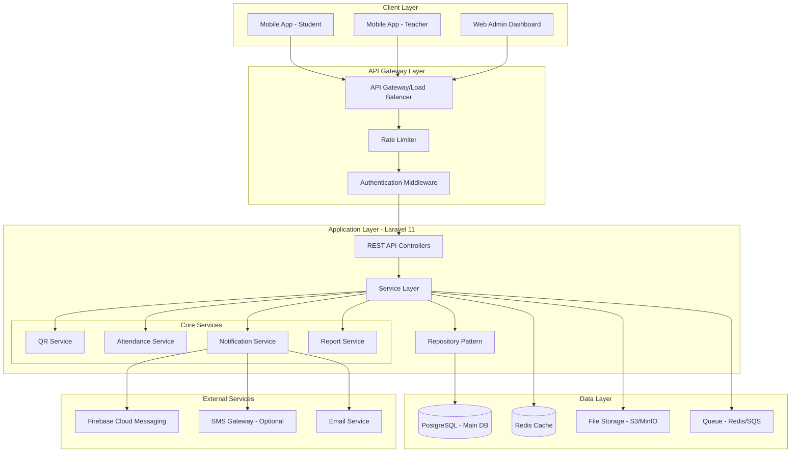
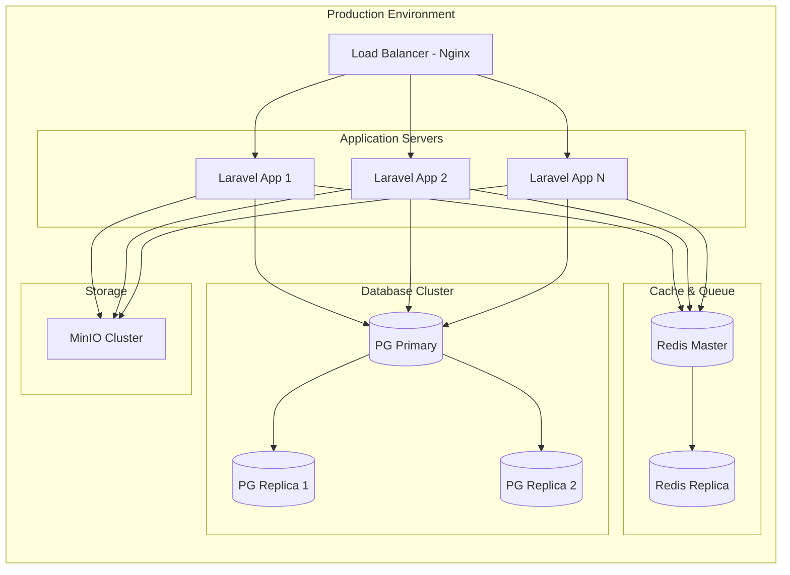
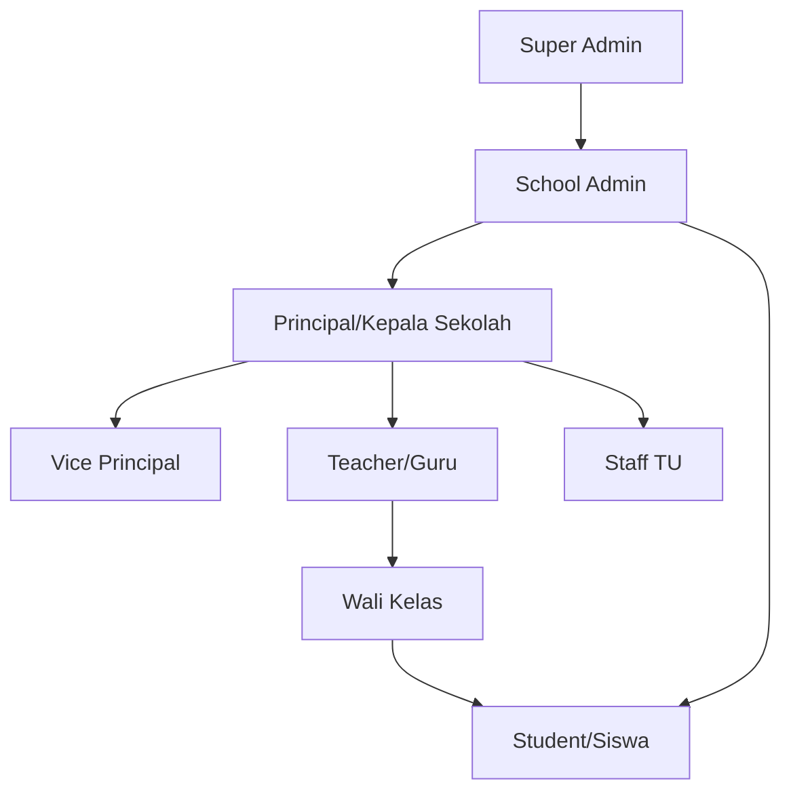
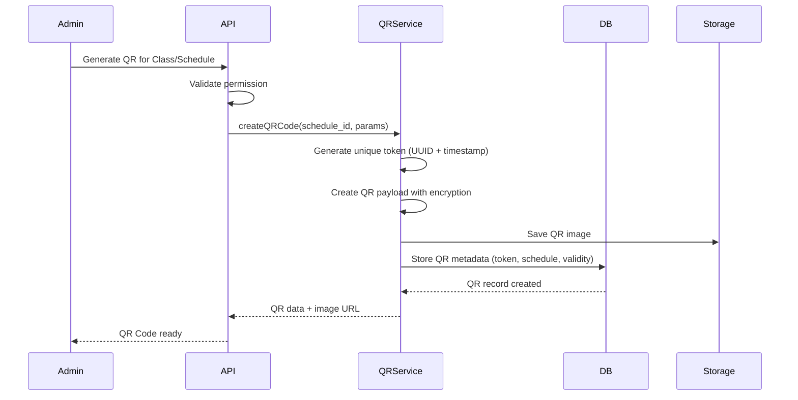
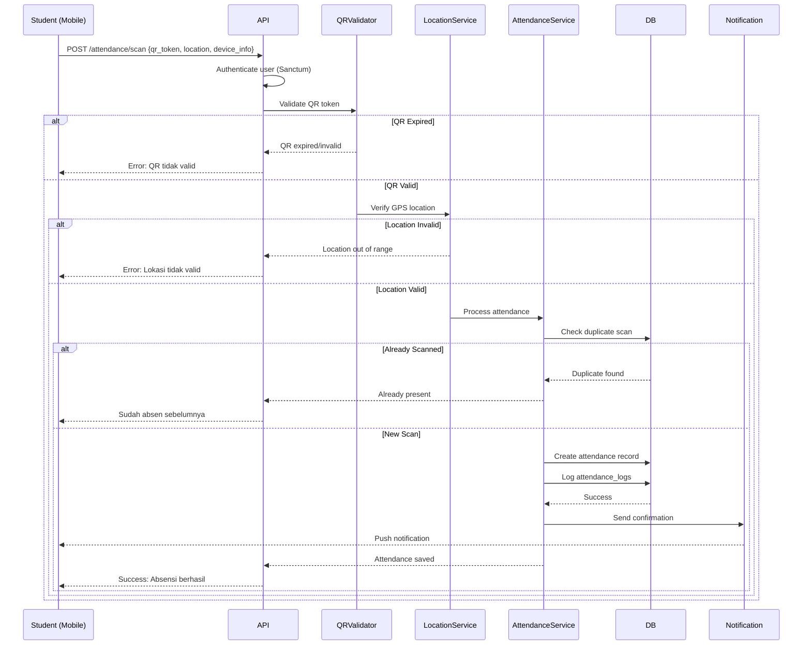
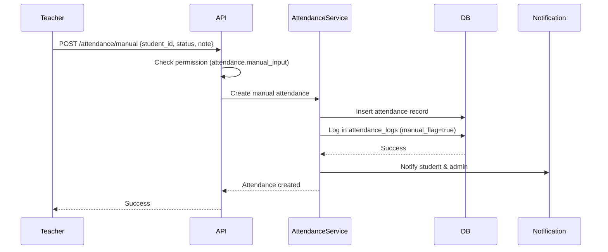
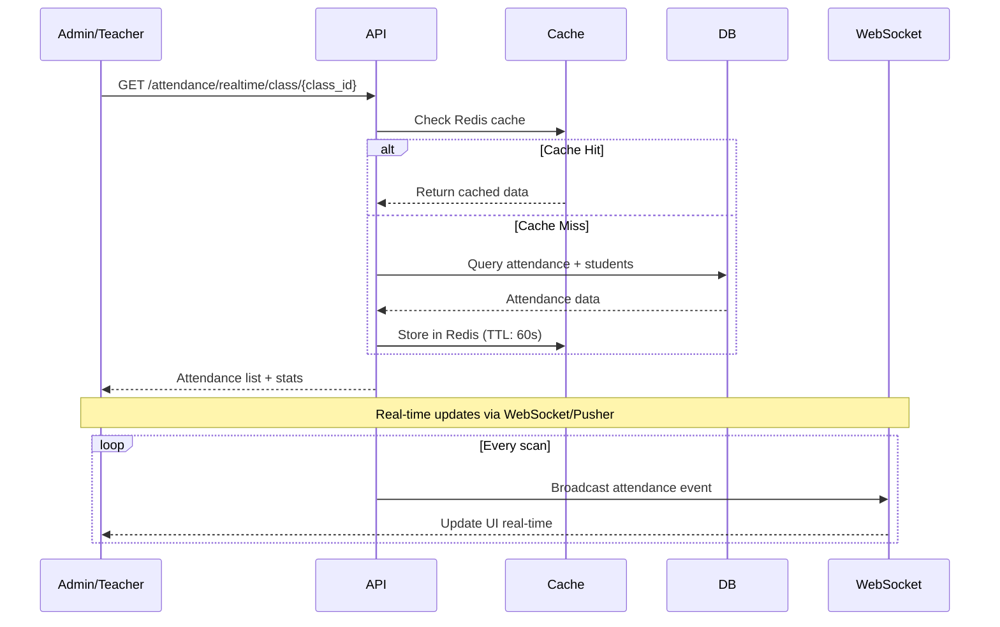

# Arsitektur Sistem Absensi QR Code - SD/SMP/SMA/SMK

## 1. Arsitektur Sistem

### 1.1 Overview Arsitektur



### 1.2 Technology Stack

#### Backend (API)
- **Framework**: Laravel 11 (PHP 8.2+)
- **Database**: PostgreSQL 15+ (ACID compliance, JSON support)
- **Cache**: Redis 7+
- **Queue**: Laravel Queue with Redis driver
- **Storage**: MinIO / AWS S3 (untuk QR codes & laporan)
- **Authentication**: Laravel Sanctum (API tokens)
- **Authorization**: Spatie Laravel Permission (RBAC)

#### Mobile App
- **Option 1 (Recommended)**: Flutter 3.x
  - Single codebase untuk iOS & Android
  - Performance native-like
  - Rich UI components
  
- **Option 2**: React Native
  - JavaScript/TypeScript ecosystem
  - Large community support

#### Web Admin
- **Framework**: Laravel Blade / Inertia.js + Vue 3
- **UI**: TailwindCSS / Bootstrap 5
- **Charts**: Chart.js / ApexCharts

### 1.3 Deployment Architecture



---

## 2. Role & Permission Structure

### 2.1 Hirarki Role



### 2.2 Role Definitions & Permissions

| Role | Kode | Permissions | Deskripsi |
|------|------|-------------|-----------|
| **Super Admin** | `super_admin` | `*.*` (all) | Manage multiple schools, system config |
| **School Admin** | `school_admin` | `school.*`, `users.*`, `classes.*`, `attendance.*` | Manage satu sekolah & semua data |
| **Principal** | `principal` | `reports.*`, `teachers.*`, `students.*`, `attendance.view` | Kepala sekolah - view & approve reports |
| **Vice Principal** | `vice_principal` | `reports.view`, `teachers.view`, `students.*`, `attendance.view` | Wakil kepala sekolah |
| **Teacher** | `teacher` | `attendance.scan`, `attendance.manual`, `students.view`, `classes.view` | Guru - scan QR, input manual |
| **Homeroom Teacher** | `homeroom_teacher` | `teacher.*`, `students.manage_class`, `attendance.report_class` | Wali kelas - manage kelas sendiri |
| **Staff TU** | `staff` | `students.*`, `attendance.export`, `reports.generate` | Staff administrasi |
| **Student** | `student` | `attendance.self_view`, `schedule.view` | Siswa - view absensi sendiri |
| **Parent** | `parent` | `attendance.view_child`, `reports.view_child` | Orang tua - view absensi anak (future) |

### 2.3 Permission Structure

```
attendance.*
├── attendance.scan
├── attendance.manual_input
├── attendance.approve
├── attendance.export
├── attendance.view_all
├── attendance.view_own
└── attendance.modify

students.*
├── students.create
├── students.update
├── students.delete
├── students.view
└── students.import

classes.*
├── classes.create
├── classes.update
├── classes.delete
├── classes.assign_students
└── classes.assign_teachers

reports.*
├── reports.generate
├── reports.export
├── reports.view_all
└── reports.approve

school.*
├── school.settings
├── school.qr_generate
└── school.academic_year
```

---

## 3. Flow Absensi QR Code

### 3.1 QR Code Generation Flow



### 3.2 Attendance Scanning Flow



### 3.3 Manual Attendance Flow (Teacher)



### 3.4 Real-time Attendance Dashboard Flow



---

## 4. Keamanan & Scalability

### 4.1 Security Measures

1. **QR Code Security**
   - Time-based expiration (default: 5-15 menit)
   - One-time use option
   - Encrypted payload: `AES-256-CBC(schedule_id + timestamp + nonce)`
   - Digital signature verification

2. **Location Verification**
   - GPS coordinate validation (radius: 50-200m dari sekolah)
   - IP whitelist untuk Web Admin
   - Device fingerprinting (prevent emulator abuse)

3. **API Security**
   - Rate limiting: 60 requests/minute per user
   - JWT token with refresh mechanism
   - CORS policy strict
   - SQL injection prevention (Eloquent ORM)
   - XSS protection (Laravel built-in)
   - CSRF tokens untuk web

4. **Data Protection**
   - Encryption at rest (database encryption)
   - Encryption in transit (HTTPS/TLS 1.3)
   - Personal data anonymization in logs
   - GDPR compliance ready

### 4.2 Scalability Features

1. **Horizontal Scaling**
   - Stateless API servers
   - Load balancer ready
   - Auto-scaling K8s deployment

2. **Database Optimization**
   - Read replicas untuk reports
   - Partitioning by academic_year
   - Proper indexing strategy

3. **Caching Strategy**
   - Redis untuk session & cache
   - QR code metadata cache (5-15 min TTL)
   - Dashboard data cache (1 min TTL)
   - Query result cache untuk reports

4. **Queue Processing**
   - Async notification (email, push)
   - Report generation queue
   - Bulk import/export queue

---

## 5. Multi-Tenant Considerations

### 5.1 Tenant Isolation

```php
// School-based tenancy
- schools table sebagai tenant root
- Semua data linked ke school_id
- Global scope untuk auto-filtering
- Middleware tenant validation
```

### 5.2 Data Isolation Strategy

| Strategy | Implementation |
|----------|----------------|
| **Database Level** | Single database, school_id in all tables |
| **Schema Level** | Future: Separate schema per school (PostgreSQL) |
| **Performance** | Indexed school_id, partitioning by school |
| **Backup** | Per-school backup script |

---

## 6. API Endpoints Overview

Lihat `api_specification.md` untuk detail lengkap.

**Core Endpoints:**
- `POST /api/v1/auth/login`
- `POST /api/v1/attendance/scan`
- `POST /api/v1/attendance/manual`
- `GET /api/v1/attendance/schedule/{id}`
- `POST /api/v1/qr/generate`
- `GET /api/v1/reports/daily`

---

## 7. Next Steps

1. Review arsitektur ini dengan stakeholder
2. Finalize database schema (lihat `database_schema.md`)
3. Setup Laravel 11 project structure
4. Implement authentication & RBAC
5. Develop QR Service & Attendance Service
6. Build Mobile App (Flutter/React Native)
7. Testing & deployment
