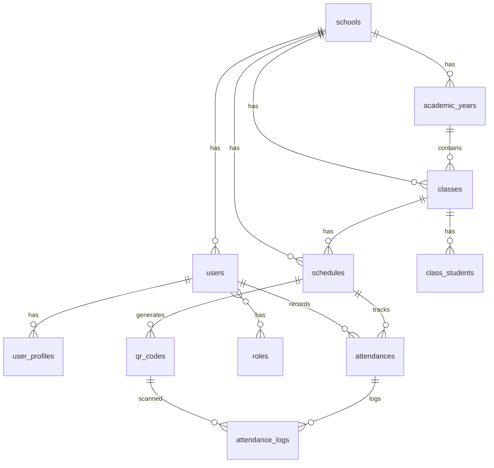

# Database Schema - Sistem Absensi QR Code

## Entity Relationship Diagram



## Core Tables

### 1. schools (Multi-tenant Root)

| Column | Type | Constraints | Description |
|--------|------|-------------|-------------|
| id | BIGINT | PK | Primary key |
| name | VARCHAR(255) | NOT NULL | Nama sekolah |
| npsn | VARCHAR(20) | UNIQUE | Nomor Pokok Sekolah Nasional |
| school_level | ENUM | NOT NULL | 'SD', 'SMP', 'SMA', 'SMK' |
| latitude | DECIMAL(10,8) | NULL | GPS koordinat |
| longitude | DECIMAL(11,8) | NULL | GPS koordinat |
| radius_meters | INT | DEFAULT 100 | Radius absensi |
| settings | JSON | NULL | Config sekolah |
| is_active | BOOLEAN | DEFAULT true | Status |
| created_at | TIMESTAMP | NOT NULL | |
| updated_at | TIMESTAMP | NOT NULL | |

**Indexes:** `npsn`, `school_level`, `is_active`

### 2. users

| Column | Type | Constraints | Description |
|--------|------|-------------|-------------|
| id | BIGINT | PK | Primary key |
| school_id | BIGINT | FK(schools) | Tenant ID |
| username | VARCHAR(100) | UNIQUE | Username |
| email | VARCHAR(100) | UNIQUE | Email |
| password | VARCHAR(255) | NOT NULL | Hashed |
| role_type | ENUM | NOT NULL | Role user |
| is_active | BOOLEAN | DEFAULT true | Status |
| device_token | VARCHAR(255) | NULL | FCM token |
| created_at | TIMESTAMP | NOT NULL | |
| updated_at | TIMESTAMP | NOT NULL | |

**Indexes:** `school_id`, `email`, `username`, `role_type`

### 3. user_profiles

| Column | Type | Constraints | Description |
|--------|------|-------------|-------------|
| id | BIGINT | PK | Primary key |
| user_id | BIGINT | FK(users) UNIQUE | User reference |
| full_name | VARCHAR(255) | NOT NULL | Nama lengkap |
| nisn | VARCHAR(10) | NULL | NISN siswa |
| nip | VARCHAR(20) | NULL | NIP guru |
| gender | ENUM | NOT NULL | 'male', 'female' |
| birth_date | DATE | NULL | Tanggal lahir |
| phone | VARCHAR(20) | NULL | No HP |
| photo_url | VARCHAR(255) | NULL | URL foto |
| created_at | TIMESTAMP | NOT NULL | |
| updated_at | TIMESTAMP | NOT NULL | |

**Indexes:** `nisn`, `nip`

### 4. academic_years

| Column | Type | Constraints | Description |
|--------|------|-------------|-------------|
| id | BIGINT | PK | Primary key |
| school_id | BIGINT | FK(schools) | Tenant ID |
| name | VARCHAR(100) | NOT NULL | e.g. "2024/2025" |
| start_date | DATE | NOT NULL | Mulai |
| end_date | DATE | NOT NULL | Selesai |
| is_active | BOOLEAN | DEFAULT false | Aktif |
| semester | ENUM | NOT NULL | '1', '2' |
| created_at | TIMESTAMP | NOT NULL | |
| updated_at | TIMESTAMP | NOT NULL | |

**UNIQUE:** `(school_id, name)`

### 5. subjects

| Column | Type | Constraints | Description |
|--------|------|-------------|-------------|
| id | BIGINT | PK | Primary key |
| school_id | BIGINT | FK(schools) | Tenant ID |
| code | VARCHAR(20) | NOT NULL | Kode mapel |
| name | VARCHAR(255) | NOT NULL | Nama mapel |
| grade_level | INT | NULL | Kelas (1-12) |
| is_active | BOOLEAN | DEFAULT true | Status |
| created_at | TIMESTAMP | NOT NULL | |
| updated_at | TIMESTAMP | NOT NULL | |

**UNIQUE:** `(school_id, code, grade_level)`

### 6. classes

| Column | Type | Constraints | Description |
|--------|------|-------------|-------------|
| id | BIGINT | PK | Primary key |
| school_id | BIGINT | FK(schools) | Tenant ID |
| academic_year_id | BIGINT | FK(academic_years) | Tahun ajaran |
| name | VARCHAR(100) | NOT NULL | e.g. "VII-A" |
| grade_level | INT | NOT NULL | Tingkat (1-12) |
| homeroom_teacher_id | BIGINT | FK(users) NULL | Wali kelas |
| max_students | INT | DEFAULT 40 | Kapasitas |
| is_active | BOOLEAN | DEFAULT true | Status |
| created_at | TIMESTAMP | NOT NULL | |
| updated_at | TIMESTAMP | NOT NULL | |

**UNIQUE:** `(school_id, academic_year_id, name)`

### 7. class_students (Pivot)

| Column | Type | Constraints | Description |
|--------|------|-------------|-------------|
| id | BIGINT | PK | Primary key |
| class_id | BIGINT | FK(classes) | Kelas |
| student_id | BIGINT | FK(users) | Siswa |
| enrollment_date | DATE | NOT NULL | Tgl masuk |
| status | ENUM | DEFAULT 'active' | 'active', 'moved', 'graduated' |
| created_at | TIMESTAMP | NOT NULL | |

**UNIQUE:** `(class_id, student_id)`

### 8. schedules

| Column | Type | Constraints | Description |
|--------|------|-------------|-------------|
| id | BIGINT | PK | Primary key |
| school_id | BIGINT | FK(schools) | Tenant ID |
| class_id | BIGINT | FK(classes) | Kelas |
| subject_id | BIGINT | FK(subjects) | Mata pelajaran |
| teacher_id | BIGINT | FK(users) | Guru |
| day_of_week | ENUM | NOT NULL | 'monday'-'sunday' |
| start_time | TIME | NOT NULL | Jam mulai |
| end_time | TIME | NOT NULL | Jam selesai |
| is_active | BOOLEAN | DEFAULT true | Status |
| created_at | TIMESTAMP | NOT NULL | |
| updated_at | TIMESTAMP | NOT NULL | |

**Indexes:** `class_id`, `teacher_id`, `day_of_week`

### 9. qr_codes

| Column | Type | Constraints | Description |
|--------|------|-------------|-------------|
| id | BIGINT | PK | Primary key |
| school_id | BIGINT | FK(schools) | Tenant ID |
| schedule_id | BIGINT | FK(schedules) | Jadwal |
| token | VARCHAR(255) | UNIQUE | Encrypted token |
| qr_type | ENUM | NOT NULL | 'in', 'out' |
| qr_image_url | VARCHAR(255) | NULL | URL QR |
| valid_from | TIMESTAMP | NOT NULL | Mulai valid |
| valid_until | TIMESTAMP | NOT NULL | Expired |
| max_scans | INT | NULL | Limit scan |
| scan_count | INT | DEFAULT 0 | Jumlah scan |
| is_active | BOOLEAN | DEFAULT true | Status |
| metadata | JSON | NULL | Extra data |
| created_at | TIMESTAMP | NOT NULL | |
| updated_at | TIMESTAMP | NOT NULL | |

**Indexes:** `token`, `schedule_id`, `is_active`

### 10. attendances

| Column | Type | Constraints | Description |
|--------|------|-------------|-------------|
| id | BIGINT | PK | Primary key |
| school_id | BIGINT | FK(schools) | Tenant ID |
| schedule_id | BIGINT | FK(schedules) | Jadwal |
| student_id | BIGINT | FK(users) | Siswa |
| attendance_date | DATE | NOT NULL | Tanggal |
| status | ENUM | NOT NULL | 'present', 'late', 'absent', 'sick', 'permit' |
| check_in_time | TIMESTAMP | NULL | Waktu masuk |
| check_out_time | TIMESTAMP | NULL | Waktu keluar |
| is_manual | BOOLEAN | DEFAULT false | Input manual |
| notes | TEXT | NULL | Keterangan |
| recorded_by | BIGINT | FK(users) NULL | User input |
| created_at | TIMESTAMP | NOT NULL | |
| updated_at | TIMESTAMP | NOT NULL | |

**UNIQUE:** `(schedule_id, student_id, attendance_date)`  
**Indexes:** `student_id`, `attendance_date`, `status`

### 11. attendance_logs (Audit Trail)

| Column | Type | Constraints | Description |
|--------|------|-------------|-------------|
| id | BIGINT | PK | Primary key |
| attendance_id | BIGINT | FK(attendances) | Attendance |
| qr_code_id | BIGINT | FK(qr_codes) NULL | QR scan |
| user_id | BIGINT | FK(users) | User pelaku |
| action | ENUM | NOT NULL | 'scan_in', 'scan_out', 'manual' |
| ip_address | VARCHAR(45) | NULL | IP |
| latitude | DECIMAL(10,8) | NULL | GPS |
| longitude | DECIMAL(11,8) | NULL | GPS |
| device_info | JSON | NULL | Device data |
| created_at | TIMESTAMP | NOT NULL | |

**Indexes:** `attendance_id`, `user_id`, `created_at`

### 12. attendance_reports

| Column | Type | Constraints | Description |
|--------|------|-------------|-------------|
| id | BIGINT | PK | Primary key |
| school_id | BIGINT | FK(schools) | Tenant ID |
| report_type | ENUM | NOT NULL | 'daily', 'weekly', 'monthly' |
| class_id | BIGINT | FK(classes) NULL | Kelas |
| student_id | BIGINT | FK(users) NULL | Siswa |
| period_start | DATE | NOT NULL | Periode mulai |
| period_end | DATE | NOT NULL | Periode akhir |
| present_count | INT | DEFAULT 0 | Hadir |
| late_count | INT | DEFAULT 0 | Terlambat |
| absent_count | INT | DEFAULT 0 | Alpa |
| attendance_rate | DECIMAL(5,2) | DEFAULT 0 | % kehadiran |
| file_url | VARCHAR(255) | NULL | Export URL |
| created_at | TIMESTAMP | NOT NULL | |

**Indexes:** `school_id`, `class_id`, `student_id`, `period_start`

## Key Indexes for Performance

```sql
-- Fast user lookup
CREATE INDEX idx_users_active_school ON users(school_id, is_active);

-- Attendance queries
CREATE INDEX idx_attendances_reporting ON attendances(school_id, attendance_date, status);
CREATE INDEX idx_attendances_student_period ON attendances(student_id, attendance_date DESC);

-- QR validation
CREATE INDEX idx_qr_codes_lookup ON qr_codes(token, is_active, valid_until) WHERE is_active = true;

-- Daily schedule
CREATE INDEX idx_schedules_active ON schedules(school_id, day_of_week, is_active) WHERE is_active = true;
```

## Sample Queries

### Get Daily Class Attendance

```sql
SELECT u.id, up.full_name, a.status, a.check_in_time
FROM class_students cs
JOIN users u ON cs.student_id = u.id
JOIN user_profiles up ON u.id = up.user_id
LEFT JOIN attendances a ON u.id = a.student_id 
    AND a.attendance_date = CURRENT_DATE
    AND a.schedule_id = ?
WHERE cs.class_id = ? AND cs.status = 'active'
ORDER BY up.full_name;
```

### Student Attendance Summary

```sql
SELECT 
    COUNT(*) FILTER (WHERE status = 'present') as present,
    COUNT(*) FILTER (WHERE status = 'late') as late,
    COUNT(*) FILTER (WHERE status = 'absent') as absent,
    ROUND(COUNT(*) FILTER (WHERE status IN ('present', 'late'))::numeric / COUNT(*) * 100, 2) as rate
FROM attendances
WHERE student_id = ? AND attendance_date BETWEEN ? AND ?;
```

## Migration Order

1. **Core**: schools, users, user_profiles, roles/permissions
2. **Academic**: academic_years, subjects, classes, schedules
3. **Attendance**: qr_codes, attendances, attendance_logs
4. **Reports**: attendance_reports, notifications

## Security Notes

- All tables dengan `school_id` untuk tenant isolation
- Soft deletes via `deleted_at` (optional)
- Audit trail via `attendance_logs` dan `audit_logs`
- Encryption untuk `qr_codes.token`
- Partitioning untuk `attendances` (by year)
