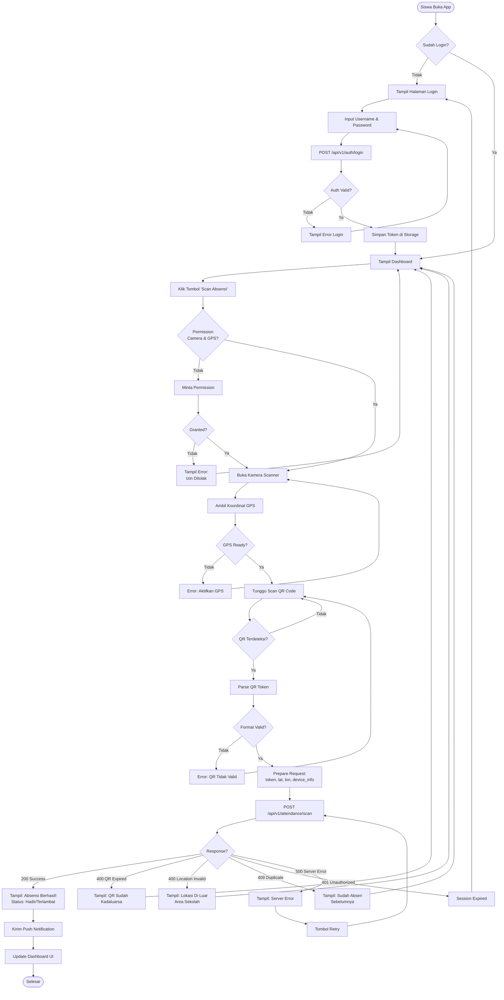
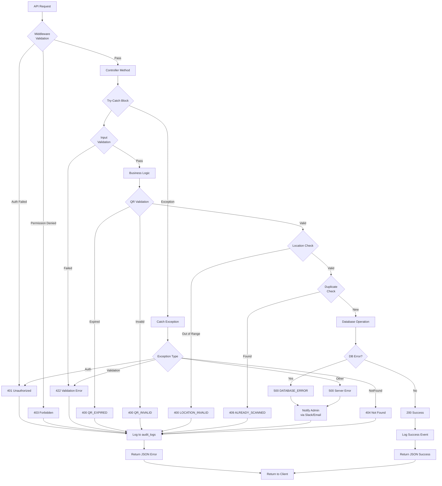
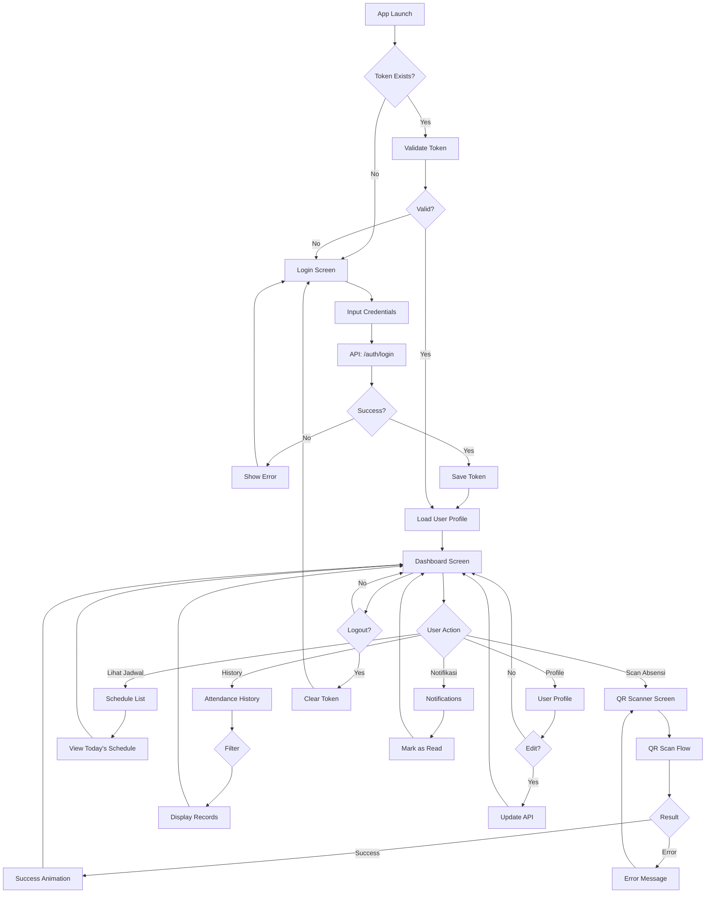

# Flow Charts - Sistem Absensi QR Code

## 1. Flow Absensi Siswa (Scan QR)

### Student Mobile App - QR Scan Flow



---

## 2. Flow Input Absensi Manual (Guru)

### Teacher Web/Mobile - Manual Input Flow

```mermaid
flowchart TD
    Start([Guru Login]) --> Dashboard[Dashboard Guru]
    Dashboard --> SelectClass[Pilih Kelas dari List]
    SelectClass --> ViewSchedule[Lihat Jadwal Hari Ini]
    
    ViewSchedule --> SelectSchedule{Pilih Jadwal<br/>Mata Pelajaran}
    SelectSchedule --> LoadAttendance[Load Daftar Siswa]
    
    LoadAttendance --> APIGetList[GET /api/v1/attendance/<br/>schedule/{id}]
    APIGetList --> DisplayList[Tampil List Siswa<br/>dengan Status]
    
    DisplayList --> CheckAuto{Ada yang<br/>belum scan?}
    CheckAuto -->|Tidak| AllComplete[Semua Sudah Absen]
    AllComplete --> ViewReport[Lihat Summary Report]
    
    CheckAuto -->|Ya| SelectStudent[Pilih Siswa]
    SelectStudent --> SelectStatus{Pilih Status}
    
    SelectStatus -->|Hadir| StatusPresent[Status: present]
    SelectStatus -->|Sakit| StatusSick[Status: sick]
    SelectStatus -->|Izin| StatusPermit[Status: permit]
    SelectStatus -->|Alpa| StatusAbsent[Status: absent]
    
    StatusPresent --> AddNote{Tambah<br/>Keterangan?}
    StatusSick --> AddNote
    StatusPermit --> AddNote
    StatusAbsent --> AddNote
    
    AddNote -->|Ya| InputNote[Input Notes]
    AddNote -->|Tidak| SkipNote[Skip Notes]
    
    InputNote --> AttachFile{Upload File<br/>Pendukung?}
    SkipNote --> AttachFile
    
    AttachFile -->|Ya| UploadFile[Upload Surat Izin/Sakit]
    AttachFile -->|Tidak| SkipFile[Skip Upload]
    
    UploadFile --> PrepareData[Prepare Manual<br/>Attendance Data]
    SkipFile --> PrepareData
    
    PrepareData --> ConfirmSave{Konfirmasi<br/>Submit?}
    ConfirmSave -->|Tidak| DisplayList
    
    ConfirmSave -->|Ya| SendManual[POST /api/v1/<br/>attendance/manual]
    SendManual --> CheckPerm{Has Permission?}
    
    CheckPerm -->|Tidak| PermError[Error 403:<br/>Tidak Ada Izin]
    PermError --> DisplayList
    
    CheckPerm -->|Ya| SaveDB[Simpan ke Database]
    SaveDB --> LogAudit[Log Audit Trail]
    LogAudit --> NotifyStudent[Notifikasi ke Siswa]
    
    NotifyStudent --> Success[Tampil: Berhasil Disimpan]
    Success --> RefreshList[Refresh List Siswa]
    RefreshList --> DisplayList
    
    ViewReport --> ExportOption{Export Laporan?}
    ExportOption -->|Ya| ExportPDF[Export ke PDF]
    ExportOption -->|Tidak| End([Selesai])
    ExportPDF --> End
```

---

## 3. Flow Generate QR Code (Admin/Guru)

### Admin/Teacher - QR Generation Flow

```mermaid
flowchart TD
    Start([Admin/Guru Login]) --> Dashboard[Dashboard]
    Dashboard --> MenuQR[Menu: Generate QR]
    
    MenuQR --> SelectAcademicYear[Pilih Tahun Ajaran Aktif]
    SelectAcademicYear --> SelectClass[Pilih Kelas]
    SelectClass --> SelectSubject[Pilih Mata Pelajaran]
    SelectSubject --> SelectSchedule[Pilih Jadwal]
    
    SelectSchedule --> DisplaySchedule[Tampil Detail Jadwal:<br/>Hari, Jam, Ruang]
    
    DisplaySchedule --> ConfigQR{Konfigurasi QR}
    
    ConfigQR --> SetType[Set QR Type:<br/>Check-In / Check-Out]
    SetType --> SetValidity[Set Masa Berlaku:<br/>Default 10 menit]
    SetValidity --> SetOptions[Opsi Tambahan]
    
    SetOptions --> OptLocation{Perlu Validasi<br/>Lokasi GPS?}
    OptLocation -->|Ya| EnableGPS[location_required: true]
    OptLocation -->|Tidak| DisableGPS[location_required: false]
    
    EnableGPS --> OptMaxScan{Set Max Scans?}
    DisableGPS --> OptMaxScan
    
    OptMaxScan -->|Ya| InputMaxScan[Input: max_scans]
    OptMaxScan -->|Tidak| UnlimitedScan[max_scans: null]
    
    InputMaxScan --> ReviewConfig[Review Konfigurasi]
    UnlimitedScan --> ReviewConfig
    
    ReviewConfig --> ConfirmGen{Konfirmasi<br/>Generate?}
    ConfirmGen -->|Tidak| ConfigQR
    
    ConfirmGen -->|Ya| CallAPI[POST /api/v1/qr/generate]
    CallAPI --> GenerateToken[Backend: Generate<br/>Encrypted Token]
    
    GenerateToken --> CreatePayload[Create Payload:<br/>schedule_id + timestamp<br/>+ nonce + version]
    CreatePayload --> EncryptPayload[Encrypt dengan<br/>AES-256-CBC]
    
    EncryptPayload --> GenerateQRImage[Generate QR Image<br/>dari Token]
    GenerateQRImage --> SaveStorage[Simpan ke Storage<br/>MinIO/S3]
    SaveStorage --> SaveMetadata[Simpan Metadata<br/>ke Database]
    
    SaveMetadata --> ReturnQR[Return QR Data]
    ReturnQR --> DisplayQR[Tampil QR Code<br/>di Layar]
    
    DisplayQR --> ActionButtons[Tombol Aksi]
    
    ActionButtons --> DownloadQR{Download?}
    DownloadQR -->|Ya| SaveImage[Download PNG/SVG]
    
    ActionButtons --> PrintQR{Print?}
    PrintQR -->|Ya| PrintDialog[Buka Print Dialog]
    
    ActionButtons --> ShareQR{Share?}
    ShareQR -->|Ya| ShareOptions[Share via Link/File]
    
    ActionButtons --> ProjectQR{Proyeksi<br/>ke Layar Besar?}
    ProjectQR -->|Ya| FullscreenMode[Fullscreen QR Display]
    
    SaveImage --> MonitorUsage[Monitor QR Usage]
    PrintDialog --> MonitorUsage
    ShareOptions --> MonitorUsage
    FullscreenMode --> MonitorUsage
    
    MonitorUsage --> ViewStats[Lihat Statistik Scan:<br/>Jumlah, Waktu, Siswa]
    
    ViewStats --> AutoExpire{QR Expired?}
    AutoExpire -->|Tidak| ViewStats
    AutoExpire -->|Ya| DeactivateQR[Auto Deactivate QR]
    
    DeactivateQR --> End([Selesai])
```



---

## 4. Flow End-to-End System

### Complete System Flow

```mermaid
flowchart LR
    subgraph "1. Setup Phase"
        A1[School Admin<br/>Register School] --> A2[Create Academic Year]
        A2 --> A3[Add Classes & Students]
        A3 --> A4[Assign Teachers<br/>to Subjects]
        A4 --> A5[Create Schedules]
    end
    
    subgraph "2. QR Generation"
        A5 --> B1[Teacher/Admin<br/>Generate QR]
        B1 --> B2[Set Validity<br/>& Options]
        B2 --> B3[QR Code Ready]
        B3 --> B4[Display/Print QR]
    end
    
    subgraph "3. Attendance Process"
        B4 --> C1[Students<br/>Scan QR]
        C1 --> C2{Validasi QR}
        C2 -->|Invalid| C3[Error Message]
        C3 --> C1
        C2 -->|Valid| C4{Validasi GPS}
        C4 -->|Out of Range| C5[Location Error]
        C5 --> C1
        C4 -->|Valid| C6{Check Duplicate}
        C6 -->|Duplicate| C7[Already Scanned]
        C6 -->|New| C8[Save Attendance]
    end
    
    subgraph "4. Manual Input"
        C8 --> D1[Teacher Reviews<br/>Attendance List]
        D1 --> D2{Ada yang<br/>belum scan?}
        D2 -->|Ya| D3[Manual Input]
        D3 --> D4[Select Status:<br/>Sick/Permit/Absent]
        D4 --> D5[Save Manual<br/>Attendance]
        D5 --> D1
        D2 -->|Tidak| D6[Complete]
    end
    
    subgraph "5. Real-time Updates"
        C8 --> E1[Broadcast Event<br/>via WebSocket]
        D5 --> E1
        E1 --> E2[Update Dashboard<br/>Real-time]
        E2 --> E3[Send Push<br/>Notification]
    end
    
    subgraph "6. Reporting"
        D6 --> F1[Generate Reports]
        F1 --> F2[Daily Report]
        F1 --> F3[Weekly Report]
        F1 --> F4[Monthly Report]
        F2 --> F5[Export PDF/Excel]
        F3 --> F5
        F4 --> F5
        F5 --> F6[Send to Principal/<br/>Parents]
    end
    
    subgraph "7. Analytics"
        F6 --> G1[Attendance Analytics]
        G1 --> G2[Attendance Rate<br/>Trends]
        G1 --> G3[Late Students<br/>Patterns]
        G1 --> G4[Absent Students<br/>Alert]
    end
```



---

## 5. Error Handling Flow

### System Error Handling



---

## 6. Real-time Dashboard Update Flow

### WebSocket / Pusher Integration

```mermaid
flowchart TD
    Start[Student Scans QR] --> SaveAttendance[Save to attendances<br/>Table]
    SaveAttendance --> TriggerEvent[Trigger Event:<br/>attendance.created]
    
    TriggerEvent --> Broadcast[Broadcast via<br/>WebSocket/Pusher]
    
    Broadcast --> Channel1[Channel:<br/>class.{class_id}]
    Broadcast --> Channel2[Channel:<br/>schedule.{schedule_id}]
    Broadcast --> Channel3[Channel:<br/>student.{student_id}]
    
    subgraph "Teacher Dashboard"
        Channel1 --> T1[Teacher Listening]
        Channel2 --> T1
        T1 --> T2{Event Received?}
        T2 -->|Yes| T3[Update UI<br/>Real-time]
        T3 --> T4[Increment Counter:<br/>Hadir +1]
        T4 --> T5[Update Student Row:<br/>Status: Hadir]
        T5 --> T6[Play Sound<br/>Notification]
        T2 -->|No| T1
    end
    
    subgraph "Admin Dashboard"
        Channel1 --> A1[Admin Listening]
        A1 --> A2{Event Received?}
        A2 -->|Yes| A3[Update Statistics]
        A3 --> A4[Update Chart<br/>Real-time]
        A4 --> A5[Refresh Summary<br/>Cards]
        A2 -->|No| A1
    end
    
    subgraph "Student Mobile App"
        Channel3 --> S1[Student App<br/>Subscribed]
        S1 --> S2{Event Received?}
        S2 -->|Yes| S3[Show Push<br/>Notification]
        S3 --> S4[Update Attendance<br/>History]
        S2 -->|No| S1
    end
    
    T6 --> Cache[Update Redis Cache]
    A5 --> Cache
    S4 --> Cache
    
    Cache --> Expire[Set TTL: 60s]
    Expire --> End([Flow Complete])
```

---

## 7. Mobile App State Flow

### Student Mobile App Navigation



---

## Legend / Simbol

| Simbol | Keterangan |
|--------|------------|
| `([Text])` | Start/End point |
| `[Text]` | Process/Action |
| `{Text}` | Decision/Condition |
| `-->` | Flow direction |
| `subgraph` | Grouped process |

---

**Catatan:**
- Semua flow chart ini bisa di-render langsung di Markdown viewers yang support Mermaid
- Untuk presentasi, bisa di-export ke PNG/SVG menggunakan tools seperti Mermaid Live Editor
- Flow ini sesuai dengan arsitektur dan API specification yang sudah dibuat
