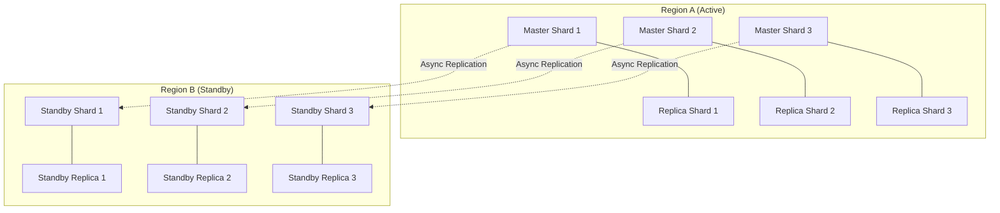

# ⚡ Multi-Region Redis Cluster Architecture

**Distributed Cache Architect**  
**Date**: 2026-02-10  
**Target**: Zero Duplicate Attendance, <50ms Latency, Region Survivor

---

## 🗺️ Cluster Topology

We utilize a **Sharded Active-Passive** strategy to ensure local-latency (<50ms) for writes while maintaining Disaster Recovery capabilities.

### Global Setup (2 Regions)

*   **Primary Region (Region A)**: `ap-southeast-1` (Singapore) - Serves Primary Workload
*   **Secondary Region (Region B)**: `ap-southeast-3` (Jakarta) - Standby / Failover Target

*(Or use independent active clusters per user shard if adhering to the Sharding Strategy previously designed)*

### Node Topology (Per Region)

We use **Redis Cluster Mode Enabled** to allow horizontal scaling of write throughput.

**Region A (Active)**:
- **Shards**: 3 Shards (Slots 0-5460, 5461-10922, 10923-16383)
- **Nodes**: 3 Master Nodes + 3 Replica Nodes (Multi-AZ)
- **Instance Type**: `cache.r6g.large` (Memory Optimized)
- **Persistence**: AOF (Append Only File) every 1 sec

**Region B (Standby/Replica)**:
- **Role**: Global Datastore Replica (Async replication from Region A)
- **Nodes**: 3 Master Nodes + 3 Replica Nodes
- **Read-Only**: Until promoted



---

## 🔐 Attendance Lock Strategy (Critical)

To guarantee **Zero Duplicate Attendance**, we implement a distributed locking mechanism strictly on the Primary Master.

### Key Structure
`attendance_lock:{school_id}:{schedule_id}:{student_id}:{date}`

### Implementation Logic (PHP)

```php
/**
 * Acquire Atomic Lock for Attendance
 * 
 * @return bool True if lock acquired, False if duplicate detected
 */
public function acquireLock(int $schoolId, int $scheduleId, int $studentId, string $date): bool
{
    $key = "attendance_lock:{$schoolId}:{$scheduleId}:{$studentId}:{$date}";
    $token = uniqid(); // Random token to identify owner
    $ttl = 120; // 120 seconds (enough for DB write)

    // SET key value NX EX 120
    // NX: Only set if not exists
    // EX: Expire in 120 seconds
    $acquired = Redis::set($key, $token, 'EX', $ttl, 'NX');

    if (!$acquired) {
        // FAIL SECURE: If lock exists, it's a duplicate attempt
        return false;
    }

    return true;
}

/**
 * Release Lock (After successful DB write)
 * Uses Lua script to ensure we only delete OUR lock
 */
public function releaseLock(string $key, string $token): void
{
    $script = <<<LUA
        if redis.call("get",KEYS[1]) == ARGV[1] then
            return redis.call("del",KEYS[1])
        else
            return 0
        end
    LUA;

    Redis::eval($script, 1, $key, $token);
}
```

### Why 120 Seconds?
- Covers worst-case DB latency (e.g., 5s).
- Covers retries.
- Short enough to auto-release if the worker crashes (Deadlock protection).

---

## 🚨 Failure & Failover Strategy

### Scenario A: Single Node Failure (in Region A)
- **Detection**: Redis Cluster protocols (Gossip).
- **Action**: Automatic Failover. The Sentinel/Cluster manager promotes the **Replica** in the same region to **Master**.
- **Impact**: < 15 seconds write stall.
- **App Response**: Retry connection 3 times with 100ms backoff.

### Scenario B: Full Region A Outage
- **Detection**: Health checks fail from multiple external points.
- **Action**: **Manual Promotion** (or scripted automated) of Region B Global Datastore to Primary.
  1. Detach Region B from Global Datastore.
  2. Point Application DNS/Config `REDIS_HOST` to Region B.
- **RPO (Recovery Point Objective)**: < 1 second (Async replication lag).
- **RTO (Recovery Time Objective)**: < 5 minutes (DNS propagation + promotion).

### Network Partition (Split Brain)
- **Quorum**: Redis Cluster requires `majority` to accept writes.
- **Strategy**: 
  - If a partition holds < 50% of nodes + 1, it stops accepting writes.
  - **App Behavior**: Returns `503 Service Unavailable` for attendance scans. **Better to fail than to create duplicates.**

---

## 💾 Memory & Capacity Estimation

### Assumptions (1 Million Students)
- Daily Active Users: 80% (800k)
- Locks per day: 800k keys.
- Cache Session: 100k active users.
- Metadata Caching: Schools, Schedules.

### Sizing Calculation

1.  **Attendance Locks**:
    - Key: ~60 bytes
    - Value: ~20 bytes
    - Overhead: ~60 bytes
    - Total: 140 bytes * 800k = **~112 MB** (Transient, expires in 2 mins, so concurrently much lower, maybe 10k max at peak = 1.4 MB). Very low.

2.  **Daily Summary Cache** (Optimization):
    - Key: `summary:{school}:{date}`
    - Size: 1 KB * 2000 schools = **2 MB**.

3.  **User Sessions**:
    - 2 KB * 100k active = **200 MB**.

4.  **Buffer**:
    - Redis works best at < 70% memory usage.

**Total Required**: ~500 MB RAM for data.
**Recommendation**: `cache.t4g.medium` (3GB RAM) or `cache.r6g.large` (13GB RAM) if expecting rapid growth.
*Note: We select `r6g.large` in the topology for network throughput stability, not just RAM.*

---

## ⏱️ Latency Estimation

| Operation | Local Region (A) | Cross Region (A -> B) | Expectation |
|:---|:---|:---|:---|
| **SET NX (Lock)** | 0.5 ms | N/A (Writes are local) | < 1 ms |
| **GET (Cache)** | 0.3 ms | N/A (Reads are local) | < 1 ms |
| **Replication Lag**| N/A | 80 ms - 150 ms | Async (Doesn't block user) |

**Result**: User perceives **< 50ms** total request time (including App processing), as Redis adds negligible latency.

---

## 👁️ Monitoring Strategy

We must track these critical metrics in CloudWatch / Datadog:

1.  **`curr_connections`**: Spike indicates connection leak.
2.  **`engine_cpu_utilization`**: If > 40% on Primary, need sharding/scaling.
3.  **`replication_lag`**: Critical for Region B DR validity. Alert if > 1s.
4.  **`evictions`**: strictly **MUST BE ZERO** for Volatile-TTL policies. If > 0, we are out of RAM.
5.  **`cmd_set_failed`**: Indicates cluster issues or read-only mode.

### Alert Thresholds
- **High**: Replication Lag > 5s
- **Critical**: Primary Node unreachable
- **Critical**: Memory Usage > 80%

---

## 📝 Configuration File (`redis.conf` optimized)

```ini
# Memory Policy: Only evict keys with TTL (Locks/Sessions)
maxmemory-policy volatile-lru

# Persistence: Durability over Speed for Attendance
appendonly yes
appendfsync everysec

# Cluster Timeouts
cluster-node-timeout 15000

# Slowlog
slowlog-log-slower-than 10000
slowlog-max-len 128
```

---

**Status**: ✅ Architecture Design Complete  
**Docs**: `REDIS_CLUSTER_STRATEGY.md`
