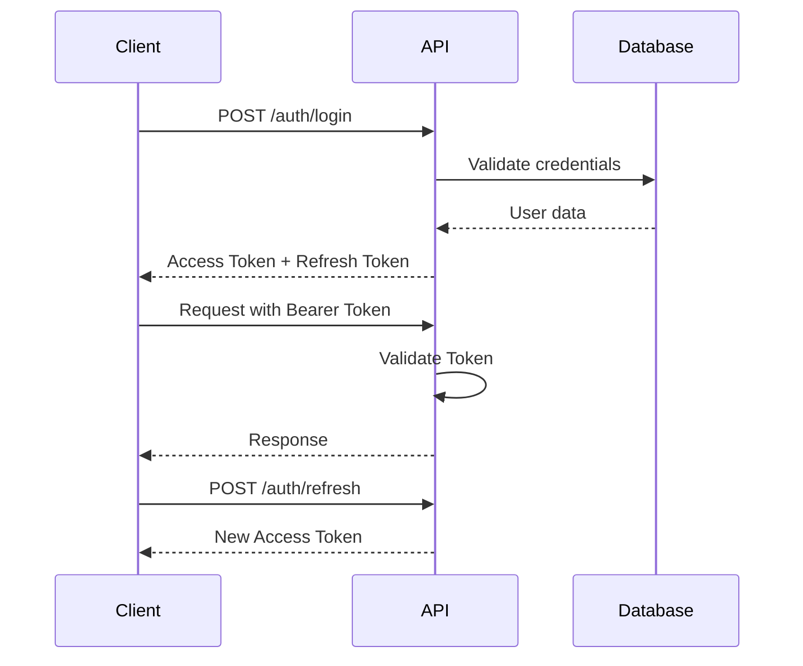

# AbsensiQRPro - API Documentation

## 📌 Overview

**Base URL:** `https://api.your-domain.com/api/v1`  
**Authentication:** Bearer Token (Laravel Sanctum)  
**Content-Type:** `application/json`  
**Date Format:** ISO 8601 (`2026-02-09T07:30:00+07:00`)

---

## 🔐 Authentication

### Authentication Flow



### Token Types

| Token Type | Lifetime | Purpose |
|------------|----------|---------|
| Access Token | 15 minutes | API requests |
| Refresh Token | 7 days | Get new access token |

### Headers Required

```http
Authorization: Bearer {access_token}
Accept: application/json
Content-Type: application/json
X-Device-ID: {device_uuid}
```

---

## 📋 Endpoints Reference

### Authentication

#### POST `/auth/login`

Login untuk semua role (student, teacher, admin, principal, parent).

**Request Body:**
```json
{
  "username": "guru001",
  "password": "SecureP@ss123",
  "device_name": "Android - Samsung Galaxy S21",
  "device_id": "a1b2c3d4-e5f6-7890-abcd-ef1234567890"
}
```

**Success Response (200):**
```json
{
  "success": true,
  "data": {
    "access_token": "1|abc123...",
    "refresh_token": "2|xyz789...",
    "token_type": "Bearer",
    "expires_in": 900,
    "user": {
      "id": 123,
      "username": "guru001",
      "name": "Budi Santoso, S.Pd.",
      "email": "budi@sekolah.sch.id",
      "role_type": "teacher",
      "school_id": 1,
      "school_name": "SMP Negeri 1 Jakarta",
      "profile": {
        "nip": "197801012006041003",
        "phone": "+6281234567890",
        "photo_url": "https://cdn.../photo.jpg"
      },
      "permissions": [
        "attendance.scan",
        "attendance.manual",
        "qr.generate",
        "class.view"
      ]
    }
  }
}
```

**Error Responses:**

| Code | Error | Message |
|------|-------|---------|
| 401 | INVALID_CREDENTIALS | Username atau password salah |
| 403 | ACCOUNT_INACTIVE | Akun tidak aktif |
| 403 | ACCOUNT_LOCKED | Akun terkunci (terlalu banyak percobaan) |
| 429 | RATE_LIMITED | Terlalu banyak percobaan login |

---

#### POST `/auth/logout`

Logout dan revoke token.

**Headers:** `Authorization: Bearer {token}`

**Response (200):**
```json
{
  "success": true,
  "message": "Berhasil logout"
}
```

---

#### POST `/auth/refresh`

Refresh access token menggunakan refresh token.

**Request Body:**
```json
{
  "refresh_token": "2|xyz789..."
}
```

**Response (200):**
```json
{
  "success": true,
  "data": {
    "access_token": "3|new_token...",
    "refresh_token": "4|new_refresh...",
    "expires_in": 900
  }
}
```

---

#### POST `/auth/forgot-password`

Request password reset.

**Request Body:**
```json
{
  "email": "user@sekolah.sch.id"
}
```

**Response (200):**
```json
{
  "success": true,
  "message": "Link reset password telah dikirim ke email"
}
```

---

### Attendance

#### POST `/attendance/scan`

Scan QR code untuk absensi (Student & Teacher).

**Request Body:**
```json
{
  "qr_token": "eyJhbGciOiJIUzI1NiJ9...",
  "latitude": -6.200000,
  "longitude": 106.816666,
  "accuracy": 15.5,
  "device_id": "a1b2c3d4-e5f6-7890-abcd-ef1234567890"
}
```

**Success Response (200):**
```json
{
  "success": true,
  "message": "Absensi berhasil direkam",
  "data": {
    "attendance_id": 456,
    "student": {
      "id": 789,
      "name": "Ahmad Fauzi",
      "nisn": "0012345678",
      "class": "VII-A"
    },
    "schedule": {
      "id": 101,
      "subject": "Matematika",
      "teacher": "Budi Santoso, S.Pd.",
      "time_slot": "07:00 - 08:30"
    },
    "attendance": {
      "status": "present",
      "check_in_time": "2026-02-09T07:05:23+07:00",
      "is_late": false,
      "late_minutes": 0
    }
  }
}
```

**Error Responses:**

| Code | Error | Message |
|------|-------|---------|
| 400 | QR_EXPIRED | QR Code sudah kadaluarsa |
| 400 | QR_INVALID | QR Code tidak valid |
| 400 | OUTSIDE_SCHEDULE | Di luar jadwal pelajaran |
| 400 | OUTSIDE_RADIUS | Lokasi di luar area sekolah |
| 400 | POOR_GPS_ACCURACY | Akurasi GPS terlalu rendah |
| 403 | DEVICE_NOT_APPROVED | Perangkat tidak terdaftar |
| 409 | ALREADY_ATTENDED | Sudah melakukan absensi |

---

#### GET `/attendance/history`

Riwayat kehadiran (Student, Teacher, Parent).

**Query Parameters:**
| Param | Type | Required | Description |
|-------|------|----------|-------------|
| start_date | date | No | Filter tanggal mulai (YYYY-MM-DD) |
| end_date | date | No | Filter tanggal akhir |
| subject_id | int | No | Filter mata pelajaran |
| status | string | No | Filter status (present/late/absent/excused) |
| page | int | No | Halaman (default: 1) |
| per_page | int | No | Item per halaman (default: 15, max: 100) |

**Response (200):**
```json
{
  "success": true,
  "data": [
    {
      "id": 456,
      "date": "2026-02-09",
      "schedule": {
        "subject": "Matematika",
        "class": "VII-A",
        "time": "07:00 - 08:30"
      },
      "status": "present",
      "check_in_time": "07:05:23",
      "is_late": false,
      "notes": null
    }
  ],
  "meta": {
    "current_page": 1,
    "last_page": 10,
    "per_page": 15,
    "total": 150
  }
}
```

---

#### GET `/attendance/summary`

Ringkasan kehadiran (untuk dashboard).

**Query Parameters:**
| Param | Type | Required | Description |
|-------|------|----------|-------------|
| student_id | int | No | ID siswa (admin only) |
| period | string | No | today/week/month/semester (default: month) |

**Response (200):**
```json
{
  "success": true,
  "data": {
    "period": "2026-02",
    "total_schedules": 60,
    "present": 55,
    "late": 3,
    "absent": 1,
    "excused": 1,
    "attendance_rate": 96.67,
    "by_subject": [
      {
        "subject_id": 1,
        "subject_name": "Matematika",
        "total": 8,
        "present": 7,
        "late": 1,
        "absent": 0
      }
    ]
  }
}
```

---

### QR Code Management

#### POST `/qr/generate`

Generate QR code untuk sesi absensi (Teacher only).

**Request Body:**
```json
{
  "schedule_id": 101,
  "type": "in",
  "validity_minutes": 5
}
```

**Response (200):**
```json
{
  "success": true,
  "data": {
    "qr_id": "qr_abc123",
    "qr_token": "eyJhbGciOiJIUzI1NiJ9...",
    "qr_image_url": "data:image/png;base64,...",
    "expires_at": "2026-02-09T07:10:00+07:00",
    "schedule": {
      "id": 101,
      "subject": "Matematika",
      "class": "VII-A",
      "time": "07:00 - 08:30"
    }
  }
}
```

---

#### GET `/qr/active`

Get QR code aktif untuk jadwal tertentu.

**Query Parameters:**
| Param | Type | Required | Description |
|-------|------|----------|-------------|
| schedule_id | int | Yes | ID jadwal |

---

### Schedule

#### GET `/schedules`

Daftar jadwal pelajaran.

**Query Parameters:**
| Param | Type | Required | Description |
|-------|------|----------|-------------|
| date | date | No | Filter tanggal |
| class_id | int | No | Filter kelas |
| teacher_id | int | No | Filter guru |
| day | string | No | Filter hari (monday-sunday) |

**Response (200):**
```json
{
  "success": true,
  "data": [
    {
      "id": 101,
      "day": "monday",
      "start_time": "07:00",
      "end_time": "08:30",
      "subject": {
        "id": 1,
        "name": "Matematika",
        "code": "MTK"
      },
      "class": {
        "id": 10,
        "name": "VII-A",
        "grade_level": 7
      },
      "teacher": {
        "id": 5,
        "name": "Budi Santoso, S.Pd."
      },
      "room": "Ruang 101"
    }
  ]
}
```

---

#### GET `/schedules/today`

Jadwal hari ini untuk user.

---

### Students

#### GET `/students`

Daftar siswa (Teacher, Admin, Principal).

**Query Parameters:**
| Param | Type | Required |
|-------|------|----------|
| class_id | int | No |
| search | string | No |
| page | int | No |

---

#### GET `/students/{id}`

Detail siswa.

---

#### GET `/students/{id}/attendance`

Riwayat kehadiran siswa tertentu.

---

### Reports

#### GET `/reports/attendance`

Laporan kehadiran.

**Query Parameters:**
| Param | Type | Required | Description |
|-------|------|----------|-------------|
| type | string | Yes | daily/weekly/monthly |
| class_id | int | No | Filter kelas |
| start_date | date | Yes | Tanggal mulai |
| end_date | date | Yes | Tanggal akhir |
| format | string | No | json/csv/pdf |

---

#### GET `/reports/teacher-performance`

Laporan kinerja guru (Principal only).

---

### Dashboard Data

#### GET `/dashboard/student`

Data dashboard siswa.

**Response (200):**
```json
{
  "success": true,
  "data": {
    "user": {
      "name": "Ahmad Fauzi",
      "class": "VII-A",
      "nisn": "0012345678"
    },
    "today_schedule": [...],
    "attendance_summary": {
      "this_month": {
        "present": 18,
        "late": 2,
        "absent": 0
      }
    },
    "upcoming_exams": [...],
    "announcements": [...]
  }
}
```

---

#### GET `/dashboard/teacher`

Data dashboard guru.

---

#### GET `/dashboard/admin`

Data dashboard admin sekolah.

---

#### GET `/dashboard/principal`

Data dashboard kepala sekolah.

---

#### GET `/dashboard/parent`

Data dashboard orang tua.

---

### Notifications

#### GET `/notifications`

Daftar notifikasi user.

---

#### POST `/notifications/{id}/read`

Tandai notifikasi sebagai dibaca.

---

#### POST `/notifications/read-all`

Tandai semua notifikasi sebagai dibaca.

---

### User Profile

#### GET `/profile`

Get profil user yang login.

---

#### PUT `/profile`

Update profil user.

**Request Body:**
```json
{
  "phone": "+6281234567890",
  "address": "Jl. Merdeka No. 123"
}
```

---

#### POST `/profile/photo`

Upload foto profil.

**Content-Type:** `multipart/form-data`

**Form Data:**
| Field | Type | Max Size |
|-------|------|----------|
| photo | file | 2MB |

---

#### PUT `/profile/password`

Ganti password.

**Request Body:**
```json
{
  "current_password": "OldP@ss123",
  "new_password": "NewP@ss456",
  "new_password_confirmation": "NewP@ss456"
}
```

---

## ❌ Error Codes

### Standard Error Response Format

```json
{
  "success": false,
  "error": "ERROR_CODE",
  "message": "Pesan error dalam bahasa Indonesia",
  "details": {
    "field_name": ["Error spesifik untuk field ini"]
  }
}
```

### Error Code Reference

| HTTP Code | Error Code | Description |
|-----------|------------|-------------|
| 400 | VALIDATION_ERROR | Data tidak valid |
| 400 | QR_EXPIRED | QR Code kadaluarsa |
| 400 | QR_INVALID | QR Code tidak valid |
| 400 | OUTSIDE_SCHEDULE | Di luar jadwal |
| 400 | OUTSIDE_RADIUS | Di luar area |
| 401 | UNAUTHORIZED | Token tidak valid |
| 401 | TOKEN_EXPIRED | Token kadaluarsa |
| 401 | INVALID_CREDENTIALS | Login gagal |
| 403 | FORBIDDEN | Tidak memiliki akses |
| 403 | ACCOUNT_INACTIVE | Akun tidak aktif |
| 403 | ACCOUNT_LOCKED | Akun terkunci |
| 403 | DEVICE_NOT_APPROVED | Perangkat tidak disetujui |
| 404 | NOT_FOUND | Resource tidak ditemukan |
| 409 | ALREADY_ATTENDED | Sudah absen |
| 409 | DUPLICATE_ENTRY | Data duplikat |
| 422 | UNPROCESSABLE | Data tidak dapat diproses |
| 429 | RATE_LIMITED | Terlalu banyak request |
| 500 | SERVER_ERROR | Kesalahan server |
| 503 | MAINTENANCE | Sistem maintenance |

---

## 🚦 Rate Limiting

### Limits per Endpoint

| Endpoint Pattern | Limit | Window |
|-----------------|-------|--------|
| `/auth/login` | 5 | 1 minute |
| `/auth/*` | 10 | 1 minute |
| `/attendance/scan` | 10 | 1 minute |
| `/qr/generate` | 20 | 1 minute |
| `GET /*` | 60 | 1 minute |
| `POST|PUT|DELETE /*` | 30 | 1 minute |

### Rate Limit Headers

Setiap response menyertakan header:

```http
X-RateLimit-Limit: 60
X-RateLimit-Remaining: 58
X-RateLimit-Reset: 1707440400
```

### Rate Limit Exceeded Response (429)

```json
{
  "success": false,
  "error": "RATE_LIMITED",
  "message": "Terlalu banyak permintaan. Coba lagi dalam 60 detik.",
  "retry_after": 60
}
```

---

## 📡 WebSocket Events

### Connection

```javascript
// Connect to WebSocket
const ws = new WebSocket('wss://ws.your-domain.com/app/{app_key}');

// Subscribe to channel
ws.send(JSON.stringify({
  event: 'pusher:subscribe',
  data: {
    channel: 'private-user.123',
    auth: 'auth_signature'
  }
}));
```

### Events

| Channel | Event | Description |
|---------|-------|-------------|
| `private-user.{id}` | `notification` | Notifikasi baru |
| `private-class.{id}` | `attendance.recorded` | Absensi tercatat |
| `private-school.{id}` | `announcement` | Pengumuman sekolah |
| `presence-class.{id}` | `member.joined` | Siswa bergabung |

---

## 🔧 SDK & Code Examples

### JavaScript/TypeScript

```typescript
import axios from 'axios';

const api = axios.create({
  baseURL: 'https://api.your-domain.com/api/v1',
  headers: {
    'Content-Type': 'application/json',
  },
});

// Add auth token
api.interceptors.request.use((config) => {
  const token = localStorage.getItem('access_token');
  if (token) {
    config.headers.Authorization = `Bearer ${token}`;
  }
  return config;
});

// Login
const login = async (username: string, password: string) => {
  const response = await api.post('/auth/login', {
    username,
    password,
    device_name: 'Web Browser',
  });
  return response.data;
};

// Scan attendance
const scanAttendance = async (qrToken: string, location: GeolocationCoordinates) => {
  const response = await api.post('/attendance/scan', {
    qr_token: qrToken,
    latitude: location.latitude,
    longitude: location.longitude,
    accuracy: location.accuracy,
  });
  return response.data;
};
```

### cURL Examples

```bash
# Login
curl -X POST https://api.your-domain.com/api/v1/auth/login \
  -H "Content-Type: application/json" \
  -d '{"username":"guru001","password":"password123"}'

# Get schedules
curl -X GET https://api.your-domain.com/api/v1/schedules/today \
  -H "Authorization: Bearer {token}"

# Scan attendance
curl -X POST https://api.your-domain.com/api/v1/attendance/scan \
  -H "Authorization: Bearer {token}" \
  -H "Content-Type: application/json" \
  -d '{"qr_token":"xxx","latitude":-6.2,"longitude":106.8}'
```

---

## 📝 Changelog

### v1.2.0 (2026-02-09)
- Added refresh token rotation
- Enhanced rate limiting per school
- Added WebSocket support

### v1.1.0 (2026-01-15)
- Added parent dashboard endpoints
- Added attendance summary by subject
- Improved error messages

### v1.0.0 (2025-12-01)
- Initial release
- Basic authentication
- Attendance scanning
- Report generation

---

*Dokumentasi ini terakhir diperbarui: Februari 2026*
