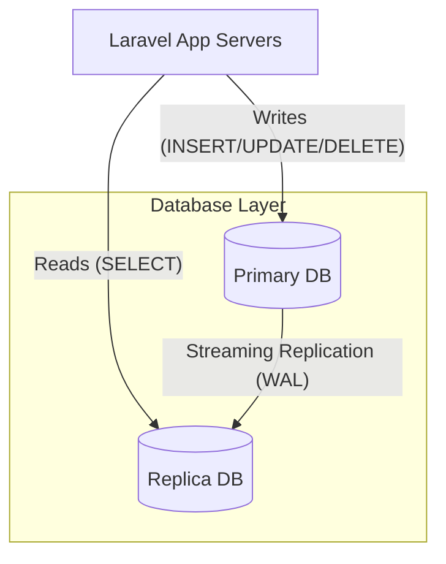

# 🛡️ Database Replication & Failover Strategy

## 1. Architecture Overview
**Primary - Replica Topology**



## 2. Configuration Strategy
We utilize Laravel's native Read/Write splitting capabilities.

- **Write Connection (`DB_HOST`)**: Points to the Primary instance. Used for all state-changing operations.
- **Read Connection (`DB_REPLICA_HOST`)**: Points to the Read Replica. Used for `select` queries.
- **Sticky Mode (`sticky: true`)**: Ensures that if a User writes data, their subsequent reads during the same request cycle come from the Primary (avoiding replication lag).

## 3. Automatic Failover Plan

### Scenario: Primary Database Failure
**Effect**: Write operations fail. Read operations *may* continue if Replica is alive.

### Recovery Procedure (AWS RDS Example)
1.  **Detection**: AWS CloudWatch detects Primary Unhealthy.
2.  **Auto-Failover**: AWS promotes the **Replica** to **Primary**.
    *   DNS Endpoint for "Primary" is updated to point to the new Primary (old Replica).
    *   This process takes 60-120 seconds.
3.  **App Recovery**:
    *   Laravel treats this as a generic connection timeout.
    *   Once DNS propagates, Laravel automatically reconnects to the new Primary.
    *   **No Manual Config Change Needed** if using AWS RDS CNAMEs.

### Recovery Procedure (Manual / Bare Metal)
1.  **Alert**: Monitoring (Prometheus/Grafana) triggers "Primary Down" alert.
2.  **Manual Promotion**:
    ```bash
    # On Replica Server
    pg_ctl promote -D /var/lib/postgresql/data
    ```
3.  **Emergency Switch**:
    *   Update `.env` on App Servers to point `DB_HOST` to the Replica's IP.
    *   Disable Replication config to prevent stale reads.
    ```env
    DB_HOST=10.0.0.5          # Old Replica IP
    DB_REPLICA_ENABLED=false  # Force all traffic to single node
    ```
4.  **Restart**: Run `php artisan config:clear` or restart queue workers.

## 4. Disaster Recovery (Region Failure)
If the entire Data Center fails:
1.  Execute **Point-in-Time Recovery (PITR)** to the DR Region using the automated backup scripts.
2.  Update `DB_HOST` in `.env` or Terraform.

## 5. Read/Write Split Implementation
The configuration is handled in `config/database.php` under the `pgsql` driver.

```php
'pgsql' => [
    'read' => [
        'host' => env('DB_REPLICA_HOST'),
    ],
    'write' => [
        'host' => env('DB_HOST'),
    ],
    'sticky' => true,
    // ...
],
```
