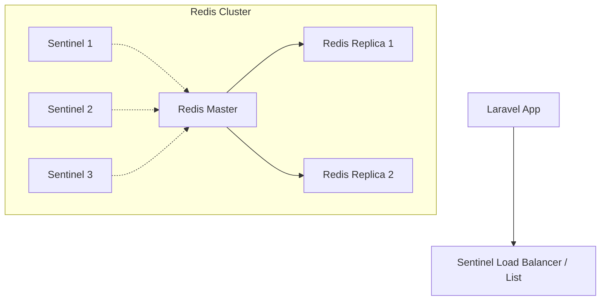

# 🔄 Redis High Availability (HA) Strategy

## 1. Architecture: Redis Sentinel
To ensure zero downtime for Session, Cache, and Queues, we utilize **Redis Sentinel**.



### Components
1.  **Redis Master**: Handles all Write operations (and Reads).
2.  **Redis Replicas**: Replicate data from Master. Can handle Reads (optional).
3.  **Sentinels**: Monitor the Master. If Master fails, they vote to promote a Replica to Master.

## 2. Configuration for Laravel
We configure Laravel to connect to the **Sentinel instances**, not the Redis Master directly. The Sentinels inform Laravel which IP is currently the Master.

### Key Config (`config/database.php`)
```php
'redis' => [
    'client' => 'predis', // Predis is recommended for Sentinel in Laravel
    'options' => [
        'replication' => 'sentinel',
        'service' => env('REDIS_SENTINEL_SERVICE', 'mymaster'),
    ],
    'default' => [
        env('REDIS_SENTINEL_1', 'tcp://10.0.0.1:26379'),
        env('REDIS_SENTINEL_2', 'tcp://10.0.0.2:26379'),
        env('REDIS_SENTINEL_3', 'tcp://10.0.0.3:26379'),
    ],
],
```

## 3. Data Persistence (AOF + RDB)
To prevent data loss (e.g., queued jobs or active sessions) if all nodes restart:

1.  **RDB (Snapshot)**: Saves DB to disk every X minutes.
    *   *Config*: `save 900 1` (Save if 1 change in 15 mins), `save 60 10000`.
2.  **AOF (Append Only File)**: Logs every write operation. Slower but safer.
    *   *Config*: `appendonly yes`, `appendfsync everysec`.

**Recommendation**: Enable **Both**. RDB for faster storage/backups, AOF for maximum durability.

## 4. Automatic Failover Process
1.  **Crash**: Redis Master process dies.
2.  **Detection**: Sentinels detect "Subjective Down" (SDOWN).
3.  **Consensus**: Sentinels agree it is "Objective Down" (ODOWN).
4.  **Promotion**: Sentinel elects a Replica to become new Master.
5.  **Reconfiguration**: Sentinels update their configuration to point to new Master.
6.  **Client Update**: Laravel (via Predis) asks Sentinel "Who is Master?" and connects to the new IP automatically.

## 5. Deployment Checklist
- [ ] Deploy 3 Sentinel Nodes (can be co-located with Redis nodes).
- [ ] Configure `sentinel.conf` with `sentinel monitor mymaster <master-ip> 6379 2`.
- [ ] Update `backend/.env` with Sentinel IPs.
- [ ] Verify `REDIS_CLIENT=predis`.
