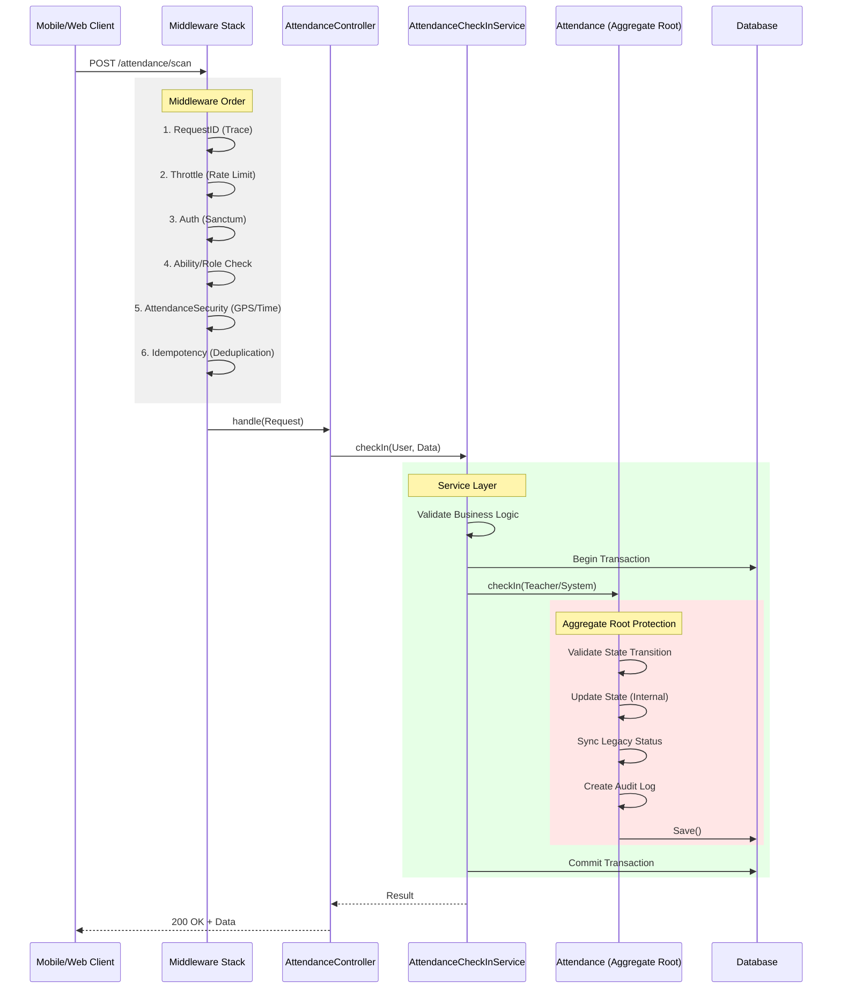

# 🔍 AUDIT ARSITEKTUR ATTENDANCE FLOW (POST-REFACTOR)

## 📊 Executive Summary

**Status:** ⚠️ **CRITICAL ISSUE FOUND**
Audit menemukan satu pelanggaran kritis pada `AttendanceSessionController` yang akan menyebabkan **System Crash (500 Error)** di production karena konflik dengan proteksi Aggregate Root yang baru diterapkan.

---

## 1. 🔄 Final Sequence Diagram (Expected Flow)



---

## 2. 🚨 Critical Violation Found

### File: `app/Http/Controllers/Api/V1/Teacher/AttendanceSessionController.php`

**Lokasi:** Method `manualAttendance` (Line 166)

```php
// ❌ WRONG: Direct Status Modification
$attendance->status = $status; 
$attendance->save();
```

**Dampak:**
Kode ini akan **CRASH** dengan `App\Exceptions\StateViolationException` karena Mutator baru (`setStatusAttribute`) sekarang memblokir modifikasi langsung dari controller.

**Pelanggaran:**
1.  **Direct Model Update:** Melanggar aturan Aggregate Root.
2.  **No Transaction:** Operasi tidak dibungkus `DB::transaction`.
3.  **Bypass State Machine:** Mencoba bypass validasi transisi state.

**Solusi:**
Refactor untuk menggunakan `AttendanceCheckInService` atau domain method `$attendance->transitionTo(...)`.

---

## 3. ✅ Audit Checklist Results

| Validasi | Status | Notes |
|----------|--------|-------|
| **1. Middleware Order** | ✅ **PASS** | `auth` → `role` → `attendance.security` → `idempotency` → `rate.limit`. Order logis dan aman. |
| **2. Controller → Service** | ⚠️ **PARTIAL** | `AttendanceController` (Student) ✅ OK. `AttendanceSessionController` (Teacher) ❌ FAIL. |
| **3. No Direct Model Updates** | ❌ **FAIL** | Ditemukan di `AttendanceSessionController`. Akan throw exception di runtime. |
| **4. DB Transaction** | ⚠️ **PARTIAL** | Missing di `AttendanceSessionController`. Ada di `AttendanceCheckInService`. |
| **5. Tenant Isolation** | ✅ **PASS** | `SchoolScope` applied global. Controller menggunakan `firstOrNew`/`validatesSchoolOwnership`. |

---

## 4. 🔓 Potensi Bypass Tersisa

1.  **Refactor Incomplete (Teacher Manual Entry):**
    -   Fitur input manual guru saat ini rusak (broken). Guru tidak bisa melakukan input manual sampai ini diperbaiki.

2.  **Raw SQL / DB::table:**
    -   Tidak ditemukan penggunaan `DB::table('attendances')->update(...)` di controller yang di-scan, namun developer harus diingatkan untuk tidak menggunakan ini karena akan mem-bypass Mutator protection.

3.  **Middleware Optimization Opportunity:**
    -   Saat ini `idempotency` berjalan *setelah* `attendance.security`.
    -   *Saran:* Pindahkan `idempotency` sebelum `attendance.security` untuk performa lebih baik (tolak duplikat sebelum cek GPS yang berat), tapi urutan sekarang tetap aman secara fungsional.

---

## 5. 🛠️ Action Plan: Files to Refactor

Hanya satu file yang memerlukan perbaikan segera:

1.  **`app/Http/Controllers/Api/V1/Teacher/AttendanceSessionController.php`**
    -   Ganti logika `manualAttendance` untuk menggunakan `AttendanceCheckInService`.
    -   Hapus manual setting `$attendance->status`.
    -   Hapus manual `AuditLog::create` (biarkan service/model yang handle).

### Contoh Refactor yang Diperlukan:

```php
// GANTI INI:
$attendance->status = $status;
$attendance->save();

// JADI INI:
$this->checkInService->manualCheckIn(
    $validatedData,
    $request->user()->id
);
```
